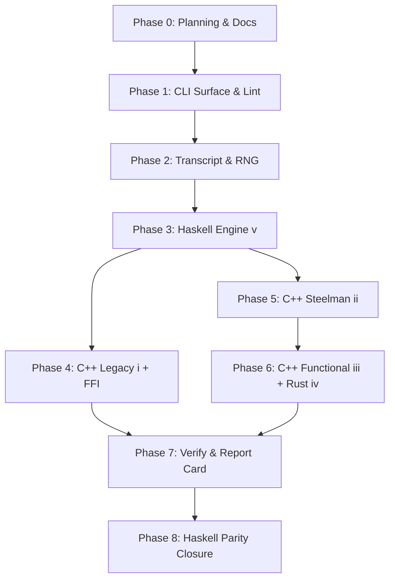

# MCTS Development Plan

**Status**: Authoritative source
**Supersedes**: N/A
**Referenced by**: [../README.md](../README.md), [../AGENTS.md](../AGENTS.md),
[../CLAUDE.md](../CLAUDE.md), [../HASKELL_CLI_TOOL.md](../HASKELL_CLI_TOOL.md),
[development_plan_standards.md](development_plan_standards.md),
[00-overview.md](00-overview.md), [system-components.md](system-components.md),
[legacy-tracking-for-deletion.md](legacy-tracking-for-deletion.md),
[phase-0-planning-documentation.md](phase-0-planning-documentation.md),
[phase-1-haskell-cli-surface.md](phase-1-haskell-cli-surface.md),
[phase-2-transcript-codec-and-determinism.md](phase-2-transcript-codec-and-determinism.md),
[phase-3-haskell-engine.md](phase-3-haskell-engine.md),
[phase-4-cpp-legacy-port-and-ffi-bridge.md](phase-4-cpp-legacy-port-and-ffi-bridge.md),
[phase-5-cpp-imperative-steelman.md](phase-5-cpp-imperative-steelman.md),
[phase-6-cpp-functional-and-rust.md](phase-6-cpp-functional-and-rust.md),
[phase-7-cross-backend-verify-and-report-card.md](phase-7-cross-backend-verify-and-report-card.md),
[phase-8-haskell-performance-parity-closure.md](phase-8-haskell-performance-parity-closure.md),
[../documents/documentation_standards.md](../documents/documentation_standards.md)
**Generated sections**: none

> **Purpose**: Provide the single execution-ordered development plan for the MCTS
> Haskell CLI and its five backends, including phase status, validation gates, and cleanup
> ownership across the bootstrap, engine buildout, FFI integration, cross-backend
> verification, and Haskell performance parity proof.

## Standards

See [development_plan_standards.md](development_plan_standards.md) for the maintenance
rules that govern this plan suite.

## Closure Status

Phase `0` is `Done`: Sprint `0.1` (plan-suite bootstrap) closed on initial
commit and Sprint `0.2` (doctrine-driven scheduling audit) closed on
2026-05-14 with the audit replay recorded in
[phase-0-planning-documentation.md](phase-0-planning-documentation.md).
Phase `1` Sprint `1.4` is closed again after the Compose-only
operator-surface doctrine change: `bootstrap/` and repository `.sh` workflow
wrappers are forbidden by `forbiddenPathRegistry`, and the updated registry passed
`docker compose run --rm --build mcts mcts test mcts-unit`,
`docker compose run --rm mcts mcts lint files`,
`docker compose run --rm mcts mcts lint all`, and
`docker compose run --rm mcts mcts check-code` on 2026-05-18. Phases `2`
through `7` are `Done` on their owned surfaces. Phase `7` closes with the test
stanzas, report-card surface, TUI surfaces, live FFI-backed Q3 verify path, Q6
legacy fixture byte guards, and the now-retired Q7 legacy-envelope
liveness/overflow gate implemented and validated. Phase `8` is
`Done` on an implementation baseline that includes:
a Cabal package with the
pinned GHC 9.14.1 / Cabal 3.16.1.0
toolchain plus the doctrine-standard dependency envelope in `mcts.cabal`;
Sprint `6.3` closed on 2026-05-16 with the Rust Corridors gameplay port
(8x8 bitfield walls, iterative BFS escapability, post-move 180-degree flip
via `u64::reverse_bits`, uniform-random rollout over real legal moves)
landing in `rust/src/board.rs`, `rust/src/rollout.rs`, and `rust/src/search.rs`,
plus `MCTS.Driver.Dispatch.runBatchDispatch` routing `--backend rust` through
`runForeignSearchGame withRustSearchGame` whenever the cdylib is present;
the Rust `mcts_rust_recompute_move` C ABI streams real parent-perspective
`chosen_equity` from the search tree, with the retired C++ recompute surfaces
preserved as historical Sprint `6.5` evidence;
`MCTS.Verify.Divergence.divergenceVsEqStream`
scores transcripts against sidecar `EqStream`s and `mcts inspect divergence`
emits per-sidecar metrics (Sprint `7.5` partial closure); `cabal.project`
relaxes `config-ini`'s `containers`/`base` upper bounds so `brick-2.12` +
`vty-6.5` resolve under GHC `9.14.1` (Sprint `7.4` unblock) with
`src/MCTS/CLI/Tui/Board.hs` rendering the 9×9 board widget through
`brick`; Sprint `8.2` has run three profile-driven rounds. Round 1 (`IntSet`-backed
BFS) shipped ~6.2× speedup; round 2 (strict-pair `Word64` visited bitmap)
regressed and was reverted; round 3 (wavefront-bitmap BFS over a strict
`Bits128` pair with precomputed direction-block masks) shipped a further
**~52× on legal-moves and ~33× on uct-search** (combined with round 1
that's **~320× / ~200×** vs the original list-based baseline). The
updated Q1 ST snapshot collapses Haskell-vs-cpp-imperative from 10.76×
(`Shortfall 9.76`) to **0.89×** (Haskell *faster* than the non-PGO
smoke library). The canonical 2026-05-19 report card against container-built
artefacts records Q1 ST **0.05×**, Q1 MT8 **0.41×**, Q2 ST **0.05×**,
Q2 MT8 **0.20×**, Q5 Haskell **0.99×**, Q5 cpp-imperative **3.64×**,
Q7 **PASS**, and `Verdict: Within tolerance`; Sprint `8.4` retired
backend (i) from live CLI/build/verify/FFI dispatch and froze its anchors under
`test/golden/cpp-legacy/`. Sprint `8.5` has recorded the backend
(iii)-vs-backend (ii) parity anchor, removed backend (ii)'s live
CLI/build/verify/FFI surface, and frozen its anchors under
`test/golden/cpp-imperative/`; Sprint `8.5` validation is closed. Sprint `8.6`
has recorded the backend (v)-vs-backend (iii) parity anchor, removed backend
(iii)'s live CLI/build/verify/FFI surface, and frozen its anchors under
`test/golden/cpp-functional/`; Sprint `8.6` validation is closed. Sprint `8.7`
closed the plan suite and cleanup ledger. The
`MCTS.Engine.ForeignRecompute` driver feeds
`MCTS.Verify.Divergence.divergenceVsEqStream` end-to-end through
`mcts inspect divergence`. `MCTS.CLI.Tui.Play` ships a brick `App`
event loop for `mcts play` with legacy-notation move input, real
`:hint`/`:undo`/`:quit` handling, and `:save` hand-play transcript writes
addressed by `sha256(run_config || move_history)` (pure dispatcher plus
write/decode path unit-tested); the shared TUI board
widget renders pawn cells plus horizontal and vertical wall segments;
the thin `app/Main.hs`;
the `CommandSpec` registry; the `optparse-applicative` parser rendered from
that registry via `commandParserInfo`; the full v1 transcript codec with the
14-field engine envelope; the `MEQ1` binary equity sidecar with same-directory
temp-file + rename writes plus fsync parity with the transcript writer;
the `Env` record and `ReaderT App` monad;
`MCTS.Plan` doctrine-shaped `buildPlan`, `applyPlan`,
`applySubprocessPlan`, `applyWithEnv`, `applySubprocessWithEnv` helpers;
the dependency-edge-aware `prerequisiteRegistry` with `transitiveClosure`,
`registryHasCycle`, exact GHC/Cabal probes, LLVM/BOLT 19 probes, Rust 1.95.0
probes, `ld.lld-19`, foreign shared-library artefact nodes, profile-directory
nodes, and `mimalloc` probing; a real ST-arena MCTS engine
(`MCTS.Search.Arena` + `MCTS.Search.UCT`) wired through every backend's
driver; deterministic multi-worker game dispatch; the pinned monotonic clock
(`getMonotonicTimeNSec`) for bench timing with an injectable test hook;
baseline equity-sidecar cache inspection/pruning with originator markers and Plan/Apply
pruning; layered envelope verify (cohort-invariant +
per-backend-slot fields); the real arena-MCTS foreign-backend engine under
`rust/src/` exposing the doctrine-shaped envelope C ABI accessor
(`mcts_rust_get_envelope`); full visit-vector Haskell FFI drivers that drive
backend (iv) through `withDynamicSearchGame` plus dynamic envelope loaders for
the live foreign backend; backend (iii)'s C++23 engine, envelope C ABI, and
shared C++ 19-step PGO/BOLT pipeline remain as retired Sprint `8.6` evidence
under `cpp-functional/` and `test/golden/cpp-functional/`;
backend (iv) Rust split into the planned module topology with `mimalloc::MiMalloc`
as the global allocator, a real Corridors gameplay port, the full
visit-vector/recompute C ABI, real `--backend rust` dispatch through
`runForeignSearchGame withRustSearchGame` whenever the cdylib is present, and
the `rustPgoBoltPlan` Plan/Apply harness validated through PGO train/merge/use
plus BOLT training/install on amd64; split generated-artifact registries in
`MCTS.Generated.Paths` and `MCTS.Generated.Sections` with marker-delimited
`GeneratedSectionRule` support and the governed CLI command matrix generated
inside `documents/engineering/cli_command_surface.md`; the full
forbidden-symbol set in `.hlint.yaml` plus the conservative
`mcts-haskell-style` source-walker guard, an unconditional `cabal format`
temp-file round-trip, and mandatory container-owned `fourmolu`/`hlint`
execution. Phase `1` now adopts the separate formatter-tools compiler policy by
building `fourmolu-0.19.0.1` and `hlint-3.10` into
`/opt/mcts-style-tools/bin/` with pinned style GHC `9.12.4`, while the project
compiler remains GHC `9.14.1`. Host-level fallback to ambient toolchains or
style binaries is never allowed. The baseline also includes byte-level goldens for the
transcript wire format and the CLI surfaces, and the four live Cabal test-suite
stanzas. The validation gate for this baseline
is `docker compose run --rm mcts mcts test all` under the pinned GHC `9.14.1`
toolchain.

## Current Validation Boundary

After the 2026-05-18 Compose-only operator-surface doctrine edit, the
selected-backend `mcts play` AI dispatch, the replay cache-miss originator
recompute path, and the 2026-05-19 Q7 legacy-envelope respec, focused
validation passed through the canonical Compose entrypoint. The selected-backend
ABI changes pass the per-backend build entries, and the focused Cabal stanzas
pass: `mcts-unit` (28 cases including `tasty-quickcheck`, `tasty-golden`, and
TUI replay layout coverage), `mcts-integration` (focused integration cases including decoded
real-binary transcript determinism), and `mcts-cross-backend` (6 cases). The
2026-05-19 full lifecycle gate
`docker compose run --rm mcts mcts test all` passed and recorded the canonical
report-card verdict `Within tolerance`. The 2026-05-19 live Q7 investigation
showed backend (i)'s legacy tree search can diverge from the steelman engines at
the report-card budget, so Q7 was deliberately specified as a five-backend
legacy-envelope liveness/overflow gate before backend (i) retirement and is now represented by the frozen
backend (i) anchor. Q3 remains the visit-vector equality gate for the
surviving `(iv)..(v)` cohort,
and Q6 remains the byte-for-byte legacy fixture anchor.

This is the final parity-proven live-cohort shape after Sprint `8.6`
validation and Sprint `8.7` plan closure. The live foreign backend has reduced
to (iv) Rust;
it dispatches through a real arena-MCTS engine behind the visit-vector C ABI
when its shared library is present, and `mcts play`
uses the selected backend's dynamic FFI search path for AI turns when the
matching shared library exists (falling back to the logical Haskell path only
when the library is absent). The Rust
backend, in particular, drives a real Corridors gameplay loop (pawn moves
+ wall placement + BFS escapability) emitting canonical action IDs.
No sprint-owned remaining work survives: Phase `8` has closed the
performance-parity proof, backend (i)/(ii)/(iii) retirements, the final
`(rust, haskell)` live-cohort validation, and the plan-closure sweep.

## Document Index

| Document | Purpose |
|----------|---------|
| [development_plan_standards.md](development_plan_standards.md) | Conventions for maintaining the development plan |
| [00-overview.md](00-overview.md) | Vision, target outcome, doctrine scope, and hard constraints |
| [system-components.md](system-components.md) | Authoritative target component inventory for the MCTS Haskell CLI and its five backends |
| [phase-0-planning-documentation.md](phase-0-planning-documentation.md) | Phase 0: Planning and documentation topology |
| [phase-1-haskell-cli-surface.md](phase-1-haskell-cli-surface.md) | Phase 1: Haskell CLI surface, `CommandSpec`, lint stack |
| [phase-2-transcript-codec-and-determinism.md](phase-2-transcript-codec-and-determinism.md) | Phase 2: Transcript codec, RNG, and determinism contract |
| [phase-3-haskell-engine.md](phase-3-haskell-engine.md) | Phase 3: Backend (v) Haskell engine |
| [phase-4-cpp-legacy-port-and-ffi-bridge.md](phase-4-cpp-legacy-port-and-ffi-bridge.md) | Phase 4: Backend (i) C++ legacy port and FFI bridge |
| [phase-5-cpp-imperative-steelman.md](phase-5-cpp-imperative-steelman.md) | Phase 5: Backend (ii) C++ imperative steelman with PGO+BOLT |
| [phase-6-cpp-functional-and-rust.md](phase-6-cpp-functional-and-rust.md) | Phase 6: Backends (iii) C++ functional-style and (iv) Rust |
| [phase-7-cross-backend-verify-and-report-card.md](phase-7-cross-backend-verify-and-report-card.md) | Phase 7: Cross-backend verify, test stanzas, POC report card |
| [phase-8-haskell-performance-parity-closure.md](phase-8-haskell-performance-parity-closure.md) | Phase 8: Haskell performance parity closure and retirement protocol |
| [legacy-tracking-for-deletion.md](legacy-tracking-for-deletion.md) | Cleanup and retirement ledger |

## Status Vocabulary

| Status | Meaning | Emoji |
|--------|---------|-------|
| **Done** | Deliverables implemented for the sprint-owned surface, validated, and aligned in docs | ✅ |
| **Active** | Work has started and remaining implementation or documentation work is explicitly listed | 🔄 |
| **Planned** | Ready to start once execution reaches the sprint in sequence | 📋 |
| **Blocked** | Closure depends on an unmet prerequisite outside ordinary sprint order, or on a prior sprint that has not closed when this work is reached | ⏸️ |

## Definition of Done

A sprint can move to `Done` only when all of the following are true:

1. Its deliverables are implemented in the worktree.
2. Its validation commands pass through the canonical `mcts` surface (or, for Phase `0`,
   through the manual lint and grep audits named in this plan until Phase `1` lands the
   `mcts check-code` command).
3. The docs listed in `Docs to update` are aligned with the implemented behavior.
4. Sprint-owned cleanup or retirement entries are reflected in
   [legacy-tracking-for-deletion.md](legacy-tracking-for-deletion.md).
5. No sprint-owned blocker or remaining work survives.
6. The doctrine sections the sprint adopts (when any) are cited by name in the
   `Deliverables` block per standards rule L.

## Phase Overview

| Phase | Name | Status | Document |
|-------|------|--------|----------|
| 0 | Planning and Documentation Topology | ✅ Done | [phase-0-planning-documentation.md](phase-0-planning-documentation.md) |
| 1 | Haskell CLI Surface, `CommandSpec`, Lint Stack | ✅ Done | [phase-1-haskell-cli-surface.md](phase-1-haskell-cli-surface.md) |
| 2 | Transcript Codec, RNG, and Determinism Contract | ✅ Done (full v1 transcript/envelope codec, cache lookup, splitmix, MEQ1 sidecars, originator markers) | [phase-2-transcript-codec-and-determinism.md](phase-2-transcript-codec-and-determinism.md) |
| 3 | Backend (v) Haskell Engine | ✅ Done (strict Word64 board baseline, recursive ST-arena UCT, deterministic tie-break, bench wiring, recompute) | [phase-3-haskell-engine.md](phase-3-haskell-engine.md) |
| 4 | Backend (i) C++ Legacy Port and FFI Bridge | ✅ Done (legacy core, FFI bindings, legacy C++ RNG split-seed fixture, full transcript driver via `mcts_legacy_search_move`, external Q6 fixtures via `legacy-to-wire`, verify legacy-parity routed through real backend (i), envelope post-link patch + runtime CPU/FP probes + foreign-engine recompute landed) | [phase-4-cpp-legacy-port-and-ffi-bridge.md](phase-4-cpp-legacy-port-and-ffi-bridge.md) |
| 5 | Backend (ii) C++ Imperative Steelman with PGO+BOLT | ✅ Done (Sprints 5.1/5.2/5.3/5.4/5.5 closed: arena-MCTS steelman engine — flat children, Word16 ply counter, thread_local move buffer, __builtin_prefetch, alignas(64); shared 19-step typed Subprocess PGO+BOLT pipeline with BOLT `-instrument` self-recording, canonical FFI training installs, idempotence/failure-mode/backend-rewrite tests, and explicit PGO fallback when BOLT data is absent; cpp-imperative + cpp-functional engine TUs and C ABI shims compile under `-fno-exceptions`; the per-rollout scratch-board item is closed as "single mutable snapshot + move-assign per ply") | [phase-5-cpp-imperative-steelman.md](phase-5-cpp-imperative-steelman.md) |
| 6 | Backends (iii) C++ Functional-Style and (iv) Rust | ✅ Done (Sprints 6.1/6.2/6.3/6.4/6.5 closed: backend (iii) has functional-style descent/data-flow internals, visit-vector/recompute dispatch, and the shared C++ canonical training/install pipeline; backend (iv) has real arena-MCTS + Corridors gameplay dispatch through FFI, cached Rust `read_visits`, full PGO train/merge/use and BOLT training/install on amd64; all foreign backends expose live envelope probes including `libm_id` + post-link `engine_build_id`. C++ shared-library BOLT still falls back to PGO in the pinned container and is tracked for Phase 8 reporting, not Phase 6 closure.) | [phase-6-cpp-functional-and-rust.md](phase-6-cpp-functional-and-rust.md) |
| 7 | Cross-Backend Verify, Test Stanzas, POC Report Card | ✅ Done (the live pre-retirement test stanzas, measured Q1/Q2/Q5 report-card fields, Q6 fixtures, `brick`/`vty` play/replay TUIs, typed verify parser surfaces, live Q3 verify, and Q7 legacy-envelope liveness/overflow coverage were implemented and validated.) | [phase-7-cross-backend-verify-and-report-card.md](phase-7-cross-backend-verify-and-report-card.md) |
| 8 | Haskell Performance Parity Closure | ✅ Done (Sprints 8.1-8.7 closed; Sprint 8.2 three profile-driven rounds — round 1 `IntSet`, round 2 reverted, round 3 wavefront-bitmap BFS (**~320× combined speedup on legal-moves, ~200× on uct-search**); Sprint 8.3 is closed with the 2026-05-19 canonical report card: Q1 ST 0.05×, Q1 MT8 0.41×, Q2 ST 0.05×, Q2 MT8 0.20×, Q5 Haskell 0.99×, Q5 cpp-imperative 3.64×, Q7 PASS, and `Verdict: Within tolerance`. Sprint 8.4 retired backend (i) and froze `test/golden/cpp-legacy/`; Sprint 8.5 retired backend (ii) and froze `test/golden/cpp-imperative/`; Sprint 8.6 retired backend (iii) and froze `test/golden/cpp-functional/`; Sprint 8.7 closed the plan suite and cleanup ledger.) | [phase-8-haskell-performance-parity-closure.md](phase-8-haskell-performance-parity-closure.md) |

## Current Plan Status

The repository has moved past bootstrap into the closed implementation baseline.
Implemented in the worktree:

- `mcts.cabal`, `cabal.project`, `app/Main.hs`, `src/MCTS/**`, `test/**`,
  `documents/cli/commands.md`, `share/man/man1/mcts.1`,
  `share/completion/{bash,zsh,fish}/`, `fourmolu.yaml`, `.hlint.yaml`, `.gitignore`.
- CLI command families: `bench`, `verify`, `inspect`, `test`, `lint`, `docs`,
  `commands`, `help`, `check-code`, `build`, and a non-interactive `play` smoke.
- Deterministic transcript encode/decode with the full v1 wire format
  including the 14-field engine envelope (cohort-invariant + per-backend
  slot fields); cache root resolution; git-style prefix lookup with the
  unique-prefix property exercised in `mcts-unit`; action enumeration;
  move notation; `splitmix64` seed mixing; the binary `MEQ1` equity
  sidecar codec with same-directory temp-file + rename writes and
  `castWord64ToDouble` round-trips. Byte-level transcript and CLI goldens live under
  `test/golden/`.
- A real ST-arena MCTS engine: `MCTS.Search.Arena` (SoA `STUArray` arena
  with `parentIdx`, `firstChildIdx`, `nChildren`, `actionId`, `visits`,
  `valueSum`) and `MCTS.Search.UCT.uctSearch` (UCT selection +
  random-rollout + backpropagation). The driver dispatches every per-move
  search through it. Cross-backend visit-count equality holds under
  `--rng cpp`; per-backend salt under `--rng native` keeps bench
  transcripts distinct.
- `inspect show --with-equity` writes a recompute-backed logical equity sidecar
  and renders the stream-backed per-move equity column. `inspect divergence`
  now resolves the target transcript and renders metrics from
  `MCTS.Verify.Divergence` rather than a fixed placeholder.
- `inspect show --envelope` renders the current transcript envelope, and
  `mcts verify ... --allow-stale` is parsed and routed through the layered
  envelope verifier covering `rng_source`, `shared_rng_build_id`,
  `cohort_config_hash`, `engine_build_id`, `compiler_id`, `fp_flags`,
  `cpu_features`, `fp_env`; JSON verify output includes structured
  `warning_details` for downgraded backend-slot warnings.
- The `Env` record and `App` monad (`ReaderT Env IO`) scaffold with the
  monotonic-clock test hook. `MCTS.Plan` exposes the doctrine-shaped
  `buildPlan` / `applyPlan` / `applySubprocessPlan` / `applyWithEnv` /
  `applySubprocessWithEnv` helpers; `MCTS.CLI.Bench` uses `monotonicNanos`
  (`getMonotonicTimeNSec`).
- The prerequisite registry carries dependency edges and resolves transitively;
  the GHC/Cabal nodes check exact pinned versions via the typed `Subprocess`
  capture boundary, the live foreign shared-library node covers backend (iv),
  and the unit suite asserts the
  registry is acyclic.
- Phase 8 GHC tuning flags landed in `mcts.cabal`: `-O2 -fllvm
  -funbox-strict-fields -fspecialise-aggressively
  -fexpose-all-unfoldings -flate-dmd-anal
  -fmax-simplifier-iterations=20 -fworker-wrapper
  -fstatic-argument-transformation`. The executable adds `-threaded`
  and the doctrine RTS pin `-A64m -n4m -qg1 -qb -T`. `INLINEABLE`
  pragmas mark selected hot-path entries in `MCTS.Rng.Mix`,
  `MCTS.Engine`, `MCTS.Search.Arena`, and `MCTS.Search.UCT`.
  `-optlo-mcpu=native` and `-optlc-mcpu=native` are intentionally
  excluded per Sprint `8.1`'s closure note (LSE-instruction assembler
  refusal on aarch64); the deferred re-introduction is tracked in
  [legacy-tracking-for-deletion.md](legacy-tracking-for-deletion.md).
  `SPECIALIZE` is a no-op for the current monomorphic kernel and the
  `MutableByteArray#` migration is a profile-driven Sprint `8.2` decision.
- Transcript writes are durable: `MCTS.Transcript.writeFileAtomically`
  uses `openBinaryTempFile`, `hFlush`, `System.Posix.Unistd.fileSynchronise`
  on the temp file's Fd, atomic rename, and best-effort fsync of the
  parent directory.
- The recompute path lives in `MCTS.Engine.Recompute`:
  `recomputeEquities` / `recomputeEqStream` replay a transcript through
  the in-process UCT and emit per-move equity records; under `--rng cpp`
  it hard-asserts visit equality and short-circuits with `AppError
  RecomputeMismatch` on the first disagreement.
  `mcts inspect show --with-equity` writes the recomputed sidecar and renders the
  stream-backed per-move equity column.
- Haskell-side FFI scaffolding lives under `src/MCTS/FFI/`:
  `MCTS.FFI.Common` (bracket helpers, `EngineEnvelope` record,
  `liftFFI` that converts foreign exceptions to `AppError FFIFailure`,
  and `withDynamicBoard` using `dlopen` / `dlsym` plus
  `foreign import ccall "dynamic"`),
  plus the per-backend wrapper in `MCTS.FFI.Rust`. Backend (i), (ii), and
  (iii)'s Haskell FFI modules are retired.
- The forbidden-path set is a typed `forbiddenPathRegistry :: [ForbiddenPath]`
  value carrying a rationale per entry; `mcts lint files` consumes it.
- The canonical `MCTS.Error.renderError` boundary has the doctrine-pinned
  `AppError -> Text` shape; `MCTS.CLI.Output.renderError` is the current
  `String` adapter for command runners. Global output parsing now defaults to
  `table` on a TTY and `plain` otherwise.
- Four live Cabal test stanzas: `mcts-unit`, `mcts-integration`,
  `mcts-cross-backend`, `mcts-haskell-style`. The
  style stanza walks every `.hs` file and rejects tab characters plus the
  conservative forbidden-symbol subset it can check textually; it also runs
  `cabal format` through a temp-file round-trip and invokes the mandatory
  container-installed `fourmolu` / `hlint` binaries from
  `/opt/mcts-style-tools/bin/`. The mandatory external formatter path is closed by
  pinning a separate formatter-tools GHC `9.12.4` and installing
  `fourmolu-0.19.0.1` plus `hlint-3.10` into the container; the fuller hard-error
  rule set lives in `.hlint.yaml` for that external `hlint` path.
- `mcts lint files` fails on tracked generated-file drift, `mcts lint haskell`
  delegates to `cabal test mcts-haskell-style`, and `mcts check-code` runs lint/docs
  plus `cabal build all` through the dedicated `MCTS.CheckCode` module.
- `mcts test all` routes recursive CLI invocations through `cabal exec mcts -- ...`,
  and `mcts bench rollouts|selfplay` accepts backend cohorts in the report-card
  command form.
- The live smoke backend source home under `rust/` declares the doctrine-shaped
  envelope struct and the current accessor symbol
  (`mcts_rust_get_envelope`) returning process-static memory. `cpp-legacy/`
  remains as a retired reference and `legacy-to-wire` fixture-generation home;
  `cpp-imperative/` remains as a retired backend (ii) reference with frozen
  anchors under `test/golden/cpp-imperative/`; `cpp-functional/` remains as a
  retired backend (iii) reference with frozen anchors under
  `test/golden/cpp-functional/`. Backend (iv) Rust is split into the planned module
  topology and uses `mimalloc::MiMalloc` as its global allocator. The Haskell
  FFI layer has bounded smoke drivers, live envelope loaders for the live
  foreign shared libraries, and verify-time conversion of those envelopes into
  transcript headers when a cdylib is present.
- `MCTS.CLI.Docs` exposes `GeneratedSectionRule`,
  `applyGeneratedSection`, and `checkGeneratedSection` for
  marker-delimited generated regions (`<!-- mcts:<key>:start --> ...
  <!-- mcts:<key>:end -->`); the current registry includes the
  `command-matrix` section in
  `documents/engineering/cli_command_surface.md`.

No remaining work is scheduled in this plan: Sprint `8.6` validation passed,
and Sprint `8.7` closed the plan suite after the surviving `(rust, haskell)`
cohort passed the canonical gates.

The retirement protocol (i)→(ii)→(iii)→(v) named in [00-overview.md](00-overview.md) and
owned by Phase `8` is the long-running closure mechanism: each retiring backend's
recorded transcripts and throughput numbers freeze in `test/golden/` as the regression
anchor for the surviving cohort. Backend (iv) Rust stays as a long-running second opinion
throughout. Backends (i), (ii), and (iii) have retired; backends (iv) and (v)
remain live.

## Sprint Dependencies

Phase `2` (transcript codec, RNG, determinism contract) gates every backend because the
wire format and the `splitmix64(master_seed, game_index)` per-game seed derivation are the
determinism contract every backend must honour. Phase `3` (Haskell engine) gates Phases
`4`–`6` because the FFI bridge from Haskell into the C ABI backends builds on the same
typed `Env` and `Subprocess` discipline established in Phase `1` and exercised by the
Haskell backend first. Phases `4`, `5`, and `6` then proceed in parallel after Phase `3`
closes — backend (i) is the regression-anchor port, backends (ii) and (iii) are the
performance ceiling and its functional sibling, and backend (iv) Rust is the
cross-language second opinion. Phase `7` joins the five backend slots in the
pre-retirement evidence surface and emits the POC report card. Phase `8` closes the Haskell tuning
loop until backend (v) matches backend (ii) within tolerance on Q1 and Q2.

## Exit Definition

This plan is complete only when all of the following are true:

1. The repository holds five backend slots behind one `mcts` binary built by Cabal:
   retired backend (i) `cpp-legacy/`, retired backend (ii)
   `cpp-imperative/`, retired backend (iii) `cpp-functional/`, live backend
   (iv) `rust`, and (v) the native Haskell engine under `src/MCTS/`.
2. `mcts bench rollouts` and `mcts bench selfplay` produce comparable wall-clock numbers
   across all live backends from a single Cabal-driven monotonic clock
   (`GHC.Clock.getMonotonicTimeNSec` in the current Haskell baseline).
3. `mcts verify rollouts` and `mcts verify selfplay` agree bit-for-bit on visit counts
   across the current live verification cohort under `--rng cpp`, with the
   `VerifyBackend` type excluding retired backends at the type level.
4. Backend (i)'s retired Q7 legacy-envelope measurement is frozen under
   `test/golden/cpp-legacy/` after the live no-overflow gate completed.
5. `mcts test all` runs every live Cabal test-suite stanza (`mcts-unit`,
   `mcts-integration`, `mcts-cross-backend`, `mcts-haskell-style`) and emits the tidy
   report-card summary block answering Q1–Q7, with the report-card knobs `G_R=1_000`,
   `G_S=4`, `G_V=4`, `G_LP=2`, `S_BENCH=500`, `S_VERIFY=500`,
   `S_LP_SIMS=10_000`, `S_LP=42` pinned in `cabal.project`.
6. Pure Haskell backend (v) matches backend (ii) C++ steelman on Q1 (random rollouts) and
   Q2 (self-play) within the parity tolerance per
   [../documents/engineering/compiler_runtime_tuning.md → Parity Tolerance](../documents/engineering/compiler_runtime_tuning.md)
   (`HASKELL_PARITY_TOLERANCE = 0.05`), both single-threaded and on 8 workers.
   If Haskell falls short — including shortfalls in the 5–15% PGO-attributable band — the
   gap is recorded against the one-known-asymmetry PGO note in
   `documents/engineering/compiler_runtime_tuning.md` rather than papered over.
7. Same-backend determinism (Q4) holds for every backend across 3 seeds: same backend,
   same master seed, same RNG source, and same logical game inputs produce identical
   determinism payloads under the `mcts-integration` stanza.
8. Backend (i) reproduces `MCTS_legacy` byte-for-byte on benchmark (b) (Q6), validated by
   the `test/golden/legacy/` fixture set regenerated through `mcts build
   legacy-fixtures` from the legacy implementation under `~/MCTS_legacy`.
9. The retirement chain (i)→(ii)→(iii)→(v) closes, with frozen golden transcripts and
   throughputs in `test/golden/` as the surviving regression anchor for each retired
   backend; backend (iv) Rust remains live as the cross-language second opinion.
10. The toolchain is pinned at GHC `9.14.1` and Cabal `3.16.1.0`. `mcts.cabal` declares
    `tested-with: ghc ==9.14.1` and `cabal.project` declares `with-compiler: ghc-9.14.1`.
11. The Haskell stack uses `optparse-applicative`, `text`, `bytestring`, `aeson`,
    `prettyprinter`, `prettyprinter-ansi-terminal`, `ansi-terminal`, `path`, `path-io`,
    `typed-process`, `safe-exceptions`, `tasty`, `tasty-hunit`, `tasty-quickcheck`,
    `tasty-golden`, and `temporary` per the doctrine's standardized stack. The two
    deviations are `brick` + `vty` for the `play` and `inspect replay` TUIs only, and
    `dhall` is unused because daemon configuration is out of scope.
12. Library-first layout: `app/Main.hs` is thin and logic lives under `src/MCTS/`.
13. `mcts.cabal` declares the five test-suite stanzas with `type: exitcode-stdio-1.0` and
    `tasty` as the in-stanza runner.
14. `CommandSpec` is the source of truth for the parser, command tree
    (`mcts commands --tree`), JSON schema (`mcts commands --json`), markdown command
    reference, manpages, and shell completion scripts. The parser is a renderer of the
    spec, not the source of truth.
15. `Subprocess` is the only IO boundary for subprocess execution. `callProcess`,
    `readCreateProcess`, `System.Process` constructors, and `typed-process` smart
    constructors are hlint-forbidden outside the `runStreaming` / `capture` interpreter.
16. Every Plan/Apply command supports `--dry-run` and `--plan-file <path>` (`mcts test
    all`, the build harness, anything that mutates external state).
17. One `prerequisiteRegistry` spans every backend's toolchain (GCC, LLVM/BOLT, `rustc`,
    `mimalloc`, `ghcup`, the PGO/BOLT profile directories) and emits
    `AppError PrerequisiteUnmet` carrying the failing `nodeId`, description, and remedy
    hint.
18. Single `AppError` ADT with `renderError :: AppError -> Text` as the only Text
    rendering at the CLI boundary; `print`, `exitFailure`, and direct terminal formatting
    are hlint-forbidden outside `src/MCTS/CLI/Output.hs`.
19. `fourmolu.yaml` at repo root pins the twelve doctrine-mandated settings
    (`indentation`, `column-limit`, `function-arrows`, `comma-style`,
    `import-export-style`, `indent-wheres`, `record-brace-space`,
    `newlines-between-decls`, `haddock-style`, `let-style`, `in-style`, `unicode`); the
    `mcts-haskell-style` stanza enforces them plus the `cabal format` temp-file
    round-trip byte-equality check through a separate pinned formatter-tools GHC
    install (`ghc-9.12.4`, `fourmolu-0.19.0.1`, `hlint-3.10`) under
    `/opt/mcts-style-tools/bin/` inside the container. Host-level fallback is
    not allowed.
20. The transcript wire format is little-endian binary with no schema-library
    dependency: one-game files, header carrying the backend-specific run config,
    per-move records of `(action_id, visits)` sorted ascending by action ID, equity
    excluded. The canonical single-byte action enumeration in
    [system-components.md](system-components.md) is authoritative.
21. The transcript cache root resolves `--cache-dir <path>` → `./.mcts-cache/`
    inside the container. The `mcts` binary does not read cache-root environment
    variables. Hash-prefix lookup is git-style: shortest unique prefix ≥ 4 hex chars; `AppError
    TranscriptNotFound` and `AppError TranscriptAmbiguous` cover the miss and ambiguous
    cases.
22. Equity is recomputed deterministically by the same backend during `inspect show
    --with-equity` and, for `inspect replay`, when the originator `.eq` overlay is
    missing before the TUI starts. The replay recompute checks the transcript's visit
    table under `--rng cpp` before writing a sidecar; cross-backend equity equality is
    not asserted, only cross-backend visit-count equality.
23. The Docker development environment provides a single LLVM pinned in
    `docker/Dockerfile` shared by GHC `-fllvm` and BOLT; the canonical host
    entrypoint is `docker compose run --rm mcts mcts <command>`. There is no
    long-running daemon container, no bind-mounted workspace, no Compose-level
    environment-variable block, and no `sleep infinity` placeholder. The first
    `docker compose run --rm` call builds the image when it is absent. All supported
    project work happens through this short-lived container entrypoint. Host-level
    `.build/` artefacts, repository `.sh` scripts, and `bootstrap/` helpers are
    unsupported.
24. [legacy-tracking-for-deletion.md](legacy-tracking-for-deletion.md) contains no
    unresolved cleanup once Phase `8` closes and the retirement protocol completes; the
    `Completed` table preserves the retirement history.

## Related Documents

- [00-overview.md](00-overview.md)
- [development_plan_standards.md](development_plan_standards.md)
- [system-components.md](system-components.md)
- [legacy-tracking-for-deletion.md](legacy-tracking-for-deletion.md)
- [../HASKELL_CLI_TOOL.md](../HASKELL_CLI_TOOL.md)
- [../documents/documentation_standards.md](../documents/documentation_standards.md)
