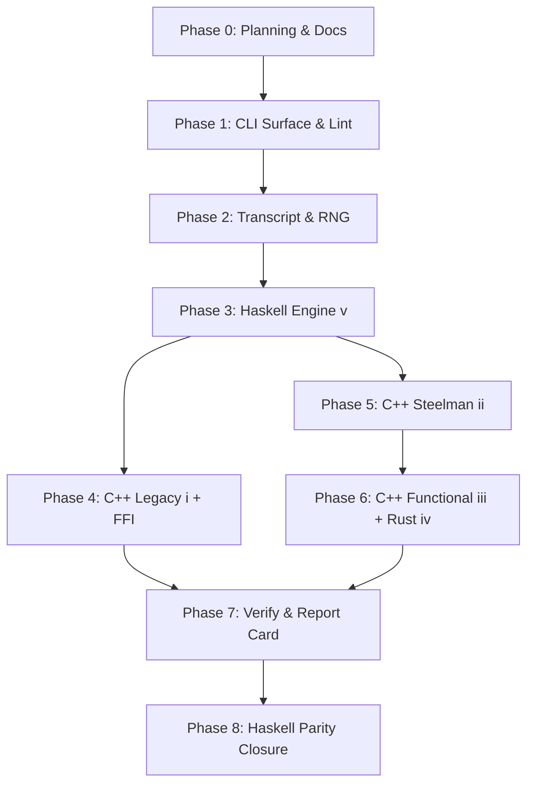

# MCTS Development Plan

**Status**: Authoritative source
**Supersedes**: N/A
**Referenced by**: [../README.md](../README.md), [../AGENTS.md](../AGENTS.md),
[../CLAUDE.md](../CLAUDE.md), [../HASKELL_CLI_TOOL.md](../HASKELL_CLI_TOOL.md),
[development_plan_standards.md](development_plan_standards.md),
[00-overview.md](00-overview.md), [system-components.md](system-components.md),
[legacy-tracking-for-deletion.md](legacy-tracking-for-deletion.md),
[phase-0-planning-documentation.md](phase-0-planning-documentation.md),
[phase-1-haskell-cli-surface.md](phase-1-haskell-cli-surface.md),
[phase-2-transcript-codec-and-determinism.md](phase-2-transcript-codec-and-determinism.md),
[phase-3-haskell-engine.md](phase-3-haskell-engine.md),
[phase-4-cpp-legacy-port-and-ffi-bridge.md](phase-4-cpp-legacy-port-and-ffi-bridge.md),
[phase-5-cpp-imperative-steelman.md](phase-5-cpp-imperative-steelman.md),
[phase-6-cpp-functional-and-rust.md](phase-6-cpp-functional-and-rust.md),
[phase-7-cross-backend-verify-and-report-card.md](phase-7-cross-backend-verify-and-report-card.md),
[phase-8-haskell-performance-parity-closure.md](phase-8-haskell-performance-parity-closure.md),
[../documents/documentation_standards.md](../documents/documentation_standards.md)
**Generated sections**: none

> **Purpose**: Provide the single execution-ordered development plan for the MCTS
> Haskell CLI and its five backends, including phase status, validation gates, and cleanup
> ownership across the bootstrap, engine buildout, FFI integration, cross-backend
> verification, and Haskell performance parity proof.

## Standards

See [development_plan_standards.md](development_plan_standards.md) for the maintenance
rules that govern this plan suite.

## Closure Status

Phase `0` is `Done`: Sprint `0.1` (plan-suite bootstrap) closed on initial
commit and Sprint `0.2` (doctrine-driven scheduling audit) closed on
2026-05-14 with the audit replay recorded in
[phase-0-planning-documentation.md](phase-0-planning-documentation.md).
The 2026-05-21 evidence-surface audit reopened the phases whose governed docs
or code overclaimed the implementation. Phase `1` reclosed Sprint `1.10` on
2026-05-21 after generated-document metadata and lint/code-quality contract
alignment passed validation. Phase `2` reclosed Sprint `2.8` on 2026-05-21
after transcript version handling, action-domain wording, and sidecar identity
passed validation. Phase `5` reclosed Sprint `5.5` on 2026-05-21 after the
compact backend (ii) C ABI contract passed validation, and reclosed Sprint `5.3`
on 2026-05-23 after the Dockerfile-owned C++ PGO/BOLT build failed closed on
missing profile data and smoked the installed bolted C++ libraries.
Phase `6` reclosed Sprint `6.6` on 2026-05-21 after backend (iii)/(iv) ABI and
Rust instrumentation/build-artifact wording passed validation, and reclosed
Sprint `6.4` on 2026-05-23 after the Dockerfile-owned Rust PGO/BOLT build failed
closed and smoked the installed bolted cdylib.
Phase `7` reclosed Sprint `7.6` on 2026-05-21 after replay/divergence evidence
labels passed validation. Phase `8` reclosed Sprint `8.3` on 2026-05-23 after
the parity report card passed against successful Dockerfile-time PGO+BOLT
artefacts, not the historical fallback artefacts. Phase `8` is now reopened for
Sprint `8.10` because the implemented PGO/BOLT training workload in
`src/MCTS/CLI/Build.hs` is still a narrow single-threaded self-play smoke run,
not the blended Q1/Q2 report-card training suite required for final steelman
evidence. Phases `3` and `4` remain `Done` on their owned engine and legacy-port
surfaces. Phases `5` and `6` remain `Done` for fail-closed PGO/BOLT mechanics,
ABI contracts, and canonical artefact installation; Sprint `8.10` owns the later
profile-representativeness dependency.

This active reopening does not change the project hypothesis: one Haskell CLI keeps
all five backend slots live, Q3 proves visit-count equivalence for `(ii)..(v)`
under `--rng cpp`, Q7 covers all five slots under the legacy envelope, and Q1/Q2
measure backend (v) Haskell against backend (ii) `cpp-imperative`.

The Phase `1` reclosure was validated with
`docker compose run --rm mcts mcts docs check`,
`docker compose run --rm mcts mcts lint docs`,
`docker compose run --rm mcts mcts test mcts-haskell-style`,
`docker compose run --rm mcts mcts check-code`, and `git diff --check`.
The Phase `2` reclosure was validated with
`docker compose run --rm mcts mcts test mcts-unit`,
`docker compose run --rm mcts mcts docs check`,
`docker compose run --rm mcts mcts check-code`, and `git diff --check`.
The Phase `5` reclosure was validated with the C++ PGO/BOLT build-recipe
dry-runs, the Dockerfile-owned backend artefact build path,
`docker compose run --rm --build mcts mcts test mcts-unit`,
`docker compose run --rm mcts mcts docs check`, and `git diff --check`.
The Phase `6` reclosure was validated with the C++ functional and Rust build-recipe
dry-runs, the Dockerfile-owned backend artefact build path,
`docker compose run --rm --build mcts mcts test mcts-unit`,
`docker compose run --rm mcts mcts docs check`, and `git diff --check`.
The Phase `7` reclosure was validated with
`docker compose run --rm mcts mcts test mcts-unit`,
`docker compose run --rm mcts mcts test mcts-integration`,
`docker compose run --rm mcts mcts docs check`,
`docker compose run --rm mcts mcts check-code`, and `git diff --check`.
The Phase `8` reclosure before Sprint `8.10` was validated with
`docker compose run --rm mcts mcts docs check`,
`docker compose run --rm mcts mcts check-code`,
`docker compose run --rm --build mcts mcts test mcts-cross-backend`,
`docker compose run --rm --build mcts mcts test all`, and `git diff --check`.
The Sprint `8.3` fail-closed report-card refresh was validated on 2026-05-23 with
`docker compose run --rm --build mcts mcts test all`; the run rebuilt the
Dockerfile-owned PGO+BOLT artefacts, passed docs, file, style, unit, integration,
cross-backend, and legacy-parity checks, and recorded Q1 ST 0.05x, Q1 MT8 0.45x,
Q2 ST 0.06x, Q2 MT8 0.22x, Q5 Haskell 0.98x, Q5 C++ (ii) 3.70x, Q7 PASS, and
`Verdict: Within tolerance`. Under Sprint `8.10`, those numbers remain
fail-closed pipeline evidence but no longer constitute final parity closure until
the Dockerfile-owned PGO/BOLT training suite covers Q1 random rollouts and Q2
self-play, single-threaded and MT8, with native RNG and multiple fixed seeds.
The later Sprint `8.8` cleanup revalidated the focused and aggregate Compose
gates without checked-in generated validation data.

The 2026-05-19 report-card evidence remains useful smoke-baseline audit context.
The previous five-backend restoration baseline still provides the starting point:
the Dockerfile builds the three C++ shared libraries and Rust before runtime
FFI-sensitive tests, `VerifyBackend` accepts the Q3 cohort `(ii)..(v)`, and
`mcts-legacy-parity` covers Q7 across all five backend slots. The 2026-05-21
optimized-C++ report-card refresh measures backend (v) Haskell against the
canonical backend (ii) artefact produced by `docker/Dockerfile` through the
`mcts build cpp-imperative` leaf; because that amd64 run installed a PGO fallback
when C++ BOLT produced no `.fdata`, it is historical evidence only under the
2026-05-22 fail-closed doctrine. The 2026-05-23 Dockerfile build no longer
publishes that fallback shape: C++ and Rust PGO/BOLT builds must produce BOLT
profiles, bolted canonical libraries, and passing final smokes before runtime
validation starts. The 2026-05-23 fail-closed report-card refresh records Q1 ST
**0.05×** (`640.3` vs `34.4` games/s), Q1 MT8 **0.45×** (`592.9` vs `269.5`
games/s), Q2 ST **0.06×** (`0.5` vs `0.0` games/s), Q2 MT8 **0.22×** (`0.5` vs
`0.1` games/s), Q5 Haskell **0.98×**, Q5 C++ (ii) **3.70×**, Q7
legacy-envelope liveness evidence **PASS**, zero live-cohort divergence, and
`Verdict: Within tolerance`. The Sprint
`8.8` no-generated-validation-data cleanup remains closed: normal tests do not
require `test/golden/` or checked-in transcript/report-card fixtures. That
baseline was validated with
`docker compose run --rm --build mcts mcts test mcts-cross-backend`,
`docker compose run --rm --build mcts mcts test all`,
`docker compose run --rm mcts mcts docs check`,
`docker compose run --rm mcts mcts check-code`, `git diff --check`, and the stale-wording
residue searches named in Sprint `8.8`.

The last validated implementation baseline includes:
a Cabal package with the
pinned GHC 9.14.1 / Cabal 3.16.1.0
toolchain plus the doctrine-standard dependency envelope in `mcts.cabal`;
Sprint `6.3` closed on 2026-05-16 with the Rust Corridors gameplay port
(8x8 bitfield walls, iterative BFS escapability, post-move 180-degree flip
via `u64::reverse_bits`, uniform-random rollout over real legal moves)
landing in `rust/src/board.rs`, `rust/src/rollout.rs`, and `rust/src/search.rs`,
plus `MCTS.Driver.Dispatch.runBatchDispatch` routing `--backend rust` through
`runForeignSearchGame withRustSearchGame` whenever the cdylib is present. The
baseline now also includes live C++ dispatch/recompute surfaces for
`cpp-legacy`, `cpp-imperative`, and `cpp-functional`, following the same dynamic
load pattern as Rust. The Rust
`mcts_rust_recompute_move` C ABI streams real parent-perspective
`chosen_equity` from the search tree;
`MCTS.Verify.Divergence.divergenceVsEqStream`
scores transcripts against sidecar `EqStream`s and `mcts inspect divergence`
emits per-sidecar metrics (Sprint `7.5` partial closure); `cabal.project`
relaxes `config-ini`'s `containers`/`base` upper bounds so `brick-2.12` +
`vty-6.5` resolve under GHC `9.14.1` (Sprint `7.4` unblock) with
`src/MCTS/CLI/Tui/Board.hs` rendering the 9×9 board widget through
`brick`; Sprint `8.2` has run three profile-driven rounds. Round 1 (`IntSet`-backed
BFS) shipped ~6.2× speedup; round 2 (strict-pair `Word64` visited bitmap)
regressed and was reverted; round 3 (wavefront-bitmap BFS over a strict
`Bits128` pair with precomputed direction-block masks) shipped a further
**~52× on legal-moves and ~33× on uct-search** (combined with round 1
that's **~320× / ~200×** vs the original list-based baseline). The
updated Q1 ST snapshot collapses Haskell-vs-cpp-imperative from 10.76×
(`Shortfall 9.76`) to **0.89×** against the historical non-PGO smoke library;
that smoke measurement is not current closure evidence. The historical 2026-05-19 report card against container-built
artefacts records Q1 ST **0.05×**, Q1 MT8 **0.41×**, Q2 ST **0.05×**,
Q2 MT8 **0.20×**, Q5 Haskell **0.99×**, Q5 cpp-imperative **3.64×**,
Q7 legacy-envelope liveness evidence **PASS**, and `Verdict: Within tolerance`.
Those numbers are historical smoke-baseline audit evidence, not permission to
remove any backend from the supported surface. The 2026-05-21 optimized-C++ run
records Q1 ST **0.05×** (`740.0` vs `39.2` games/s), Q1 MT8 **0.43×** (`690.7`
vs `294.7` games/s), Q2 ST **0.06×** (`0.6` vs `0.0` games/s), Q2 MT8
**0.19×** (`0.6` vs `0.1` games/s), Q5 Haskell **1.04×**, Q5 cpp-imperative
**3.64×**, Q7 legacy-envelope liveness evidence **PASS**, and
`Verdict: Within tolerance`.
Q3 covers `cpp-imperative`, `cpp-functional`, `rust`, and `haskell` under
`--rng cpp`, and Q7 covers all five backend slots under the legacy envelope.
Sprint `8.7` closed the plan-suite cleanup ledger structure, and Sprint `8.8`
closed the no-generated-validation-data cleanup. The
`MCTS.Engine.ForeignRecompute` driver feeds
`MCTS.Verify.Divergence.divergenceVsEqStream` end-to-end through
`mcts inspect divergence`. `MCTS.CLI.Tui.Play` ships a brick `App`
event loop for `mcts play` with legacy-notation move input, real
`:hint`/`:undo`/`:quit` handling, and `:save` hand-play transcript writes
addressed by `sha256(run_config || move_history)` (pure dispatcher plus
write/decode path unit-tested); the shared TUI board
widget renders pawn cells plus horizontal and vertical wall segments;
the thin `app/Main.hs`;
the `CommandSpec` registry; the `optparse-applicative` parser rendered from
that registry via `commandParserInfo`; the full v1 transcript codec with the
14-field engine envelope; the `MEQ1` binary equity sidecar with same-directory
temp-file + rename writes plus fsync parity with the transcript writer;
the `Env` record and `ReaderT App` monad;
`MCTS.Plan` doctrine-shaped `buildPlan`, `applyPlan`,
`applySubprocessPlan`, `applyWithEnv`, `applySubprocessWithEnv` helpers;
the dependency-edge-aware `prerequisiteRegistry` with `transitiveClosure`,
`registryHasCycle`, exact GHC/Cabal probes, LLVM/BOLT 19 probes, Rust 1.95.0
probes, `ld.lld-19`, Rust cdylib/profile-directory nodes, C++/`mimalloc` probing,
and C++ PGO/BOLT prerequisite coverage; a real ST-arena MCTS engine
(`MCTS.Search.Arena` + `MCTS.Search.UCT`) wired through every backend's
driver; deterministic multi-worker game dispatch; the pinned monotonic clock
(`getMonotonicTimeNSec`) for bench timing with an injectable test hook;
baseline equity-sidecar cache inspection/pruning with originator markers and Plan/Apply
pruning; layered envelope verify (cohort-invariant +
per-backend-slot fields); the real arena-MCTS foreign-backend engine under
`rust/src/` exposing the doctrine-shaped envelope C ABI accessor
(`mcts_rust_get_envelope`); search/recompute Haskell FFI drivers drive
backends `(i)`-`(iv)` through `withDynamicSearchGame` plus dynamic envelope
loaders for each live foreign backend. Backend (iii)'s C++23 engine, envelope C ABI, and
Makefile-level C++ PGO/BOLT targets remain part of the first-class source tree
under `cpp-functional/`, and supported CLI wiring for those targets is closed by
Sprint `5.3`;
backend (iv) Rust split into the planned module topology with a local
`SystemMiMalloc` wrapper over the container `libmimalloc` as the global allocator,
a real Corridors gameplay port, the search/recompute/read-visits
C ABI, real `--backend rust` dispatch through
`runForeignSearchGame withRustSearchGame` whenever the cdylib is present, and
the `rustPgoBoltPlan` Plan/Apply harness validated through PGO train/merge/use
plus BOLT training/install on amd64; split generated-artifact registries in
`MCTS.Generated.Paths` and `MCTS.Generated.Sections` with marker-delimited
`GeneratedSectionRule` support and the governed CLI command matrix generated
inside `documents/engineering/cli_command_surface.md`; the full
forbidden-symbol set in `.hlint.yaml` plus the conservative
`mcts-haskell-style` source-walker guard, an unconditional `cabal format`
temp-file round-trip, and mandatory container-owned `fourmolu`/`hlint`
execution. Phase `1` now adopts the separate formatter-tools compiler policy by
building `fourmolu-0.19.0.1` and `hlint-3.10` into
`/opt/mcts-style-tools/bin/` with pinned style GHC `9.12.4`, while the project
compiler remains GHC `9.14.1`. Host-level fallback to ambient toolchains or
style binaries is never allowed. The baseline uses semantic/property/temp-dir
tests for transcript, renderer, report-card, and backend-equivalence evidence; no
checked-in generated validation data is a normal test input. The validation gate for this baseline
is `docker compose run --rm mcts mcts test all` under the pinned GHC `9.14.1`
toolchain.

## Current Validation Boundary

After the 2026-05-18 Compose-only operator-surface doctrine edit, the
selected-backend `mcts play` AI dispatch and the 2026-05-19 Q7 legacy-envelope
respec, focused validation passed through the canonical Compose entrypoint. Sprint
`7.6` revalidated replay cache-miss originator/foreign labeling. The selected-backend
ABI changes pass the per-backend build entries, and the focused Cabal stanzas
pass: `mcts-unit` (28 cases including `tasty-quickcheck`, C++ PGO/BOLT plan checks,
and semantic TUI replay
layout coverage), `mcts-integration` (25 integration cases including Haskell/Rust
real-binary transcript determinism, Rust live FFI envelope/stamping checks, and
synthetic C++ backend-equivalence evidence), and `mcts-cross-backend` (7 cases). The
2026-05-20 rebuilt full lifecycle gate
`docker compose run --rm mcts mcts test all` passed after the restored C++ RNG bridge
cleanup and recorded the smoke-baseline report-card verdict `Within tolerance`. The
2026-05-21 full lifecycle gate passed after the C++ PGO/BOLT Plan/Apply closure and
recorded the optimized-C++ report-card verdict `Within tolerance`. The
2026-05-19 live Q7 investigation
showed backend (i)'s legacy tree search can diverge from the steelman engines at
the report-card budget, so Q7 is deliberately specified as a five-backend
legacy-envelope liveness/overflow gate rather than a backend (i) visit-vector
identity proof. Q3 remains the visit-vector equality gate for `(ii)..(v)` under
`--rng cpp`, and Q6 remains byte-for-byte legacy evidence generated explicitly
for audit rather than a checked-in fixture input.

The 2026-05-19 clean-clone fixture audit is closed: `test/golden/` generated
artifacts are deleted, `mcts-unit` no longer uses `tasty-golden`, and
`mcts-integration` uses synthetic transcripts in temporary roots where fixture
shape rather than engine execution is under test.

The live-cohort shape is all five backends. C++ and Rust dispatch through live
search/recompute C ABIs when their shared libraries are present, and `mcts play`
uses the selected backend's dynamic FFI search path for AI turns when the
matching shared library exists (falling back to the logical Haskell path only
when the library is absent). The Rust backend drives a real Corridors gameplay
loop (pawn moves + wall placement + BFS escapability) emitting canonical action
IDs. The restored five-backend surface remains the baseline, and the focused
evidence-surface reclosure has closed in the owning phases listed below, except
that Phase `8` is active again for Sprint `8.10` until the PGO/BOLT training
workload matches the blended report-card profile doctrine.

## Document Index

| Document | Purpose |
|----------|---------|
| [development_plan_standards.md](development_plan_standards.md) | Conventions for maintaining the development plan |
| [00-overview.md](00-overview.md) | Vision, target outcome, doctrine scope, and hard constraints |
| [system-components.md](system-components.md) | Authoritative target component inventory for the MCTS Haskell CLI and its five backends |
| [phase-0-planning-documentation.md](phase-0-planning-documentation.md) | Phase 0: Planning and documentation topology |
| [phase-1-haskell-cli-surface.md](phase-1-haskell-cli-surface.md) | Phase 1: Haskell CLI surface, `CommandSpec`, lint stack |
| [phase-2-transcript-codec-and-determinism.md](phase-2-transcript-codec-and-determinism.md) | Phase 2: Transcript codec, RNG, and determinism contract |
| [phase-3-haskell-engine.md](phase-3-haskell-engine.md) | Phase 3: Backend (v) Haskell engine |
| [phase-4-cpp-legacy-port-and-ffi-bridge.md](phase-4-cpp-legacy-port-and-ffi-bridge.md) | Phase 4: Backend (i) C++ legacy port and FFI bridge |
| [phase-5-cpp-imperative-steelman.md](phase-5-cpp-imperative-steelman.md) | Phase 5: Backend (ii) C++ imperative steelman with PGO+BOLT |
| [phase-6-cpp-functional-and-rust.md](phase-6-cpp-functional-and-rust.md) | Phase 6: Backends (iii) C++ functional-style and (iv) Rust |
| [phase-7-cross-backend-verify-and-report-card.md](phase-7-cross-backend-verify-and-report-card.md) | Phase 7: Cross-backend verify, test stanzas, POC report card |
| [phase-8-haskell-performance-parity-closure.md](phase-8-haskell-performance-parity-closure.md) | Phase 8: Haskell performance parity closure and five-backend restoration |
| [legacy-tracking-for-deletion.md](legacy-tracking-for-deletion.md) | Cleanup and stale-surface ledger |

## Status Vocabulary

| Status | Meaning | Emoji |
|--------|---------|-------|
| **Done** | Deliverables implemented for the sprint-owned surface, validated, and aligned in docs | ✅ |
| **Active** | Work has started and remaining implementation or documentation work is explicitly listed | 🔄 |
| **Planned** | Ready to start once execution reaches the sprint in sequence | 📋 |
| **Blocked** | Closure depends on an unmet prerequisite outside ordinary sprint order, or on a prior sprint that has not closed when this work is reached | ⏸️ |

## Definition of Done

A sprint can move to `Done` only when all of the following are true:

1. Its deliverables are implemented in the worktree.
2. Its validation commands pass through the canonical `mcts` surface (or, for Phase `0`,
   through the manual lint and grep audits named in this plan until Phase `1` lands the
   `mcts check-code` command).
3. The docs listed in `Docs to update` are aligned with the implemented behavior.
4. Sprint-owned cleanup or stale-surface entries are reflected in
   [legacy-tracking-for-deletion.md](legacy-tracking-for-deletion.md).
5. No sprint-owned blocker or remaining work survives.
6. The doctrine sections the sprint adopts (when any) are cited by name in the
   `Deliverables` block per standards rule L.

## Phase Overview

| Phase | Name | Status | Document |
|-------|------|--------|----------|
| 0 | Planning and Documentation Topology | ✅ Done | [phase-0-planning-documentation.md](phase-0-planning-documentation.md) |
| 1 | Haskell CLI Surface, `CommandSpec`, Lint Stack | ✅ Done (Sprint `1.10` generated-doc metadata and style contract realignment closed 2026-05-21) | [phase-1-haskell-cli-surface.md](phase-1-haskell-cli-surface.md) |
| 2 | Transcript Codec, RNG, and Determinism Contract | ✅ Done (Sprint `2.8` transcript/version/action/sidecar identity realignment closed 2026-05-21) | [phase-2-transcript-codec-and-determinism.md](phase-2-transcript-codec-and-determinism.md) |
| 3 | Backend (v) Haskell Engine | ✅ Done (strict Word64 board baseline, recursive ST-arena UCT, deterministic tie-break, bench wiring, recompute) | [phase-3-haskell-engine.md](phase-3-haskell-engine.md) |
| 4 | Backend (i) C++ Legacy Port and FFI Bridge | ✅ Done | [phase-4-cpp-legacy-port-and-ffi-bridge.md](phase-4-cpp-legacy-port-and-ffi-bridge.md) |
| 5 | Backend (ii) C++ Imperative Steelman with PGO+BOLT | ✅ Done (Sprint `5.3` fail-closed C++ PGO/BOLT reclosure and Sprint `5.5` compact C ABI contract reclosure are complete) | [phase-5-cpp-imperative-steelman.md](phase-5-cpp-imperative-steelman.md) |
| 6 | Backends (iii) C++ Functional-Style and (iv) Rust | ✅ Done (Sprint `6.4` fail-closed Rust PGO/BOLT reclosure and Sprint `6.6` compact ABI/build wording reclosure are complete) | [phase-6-cpp-functional-and-rust.md](phase-6-cpp-functional-and-rust.md) |
| 7 | Cross-Backend Verify, Test Stanzas, POC Report Card | ✅ Done (Sprint `7.6` replay/divergence evidence labels closed 2026-05-21) | [phase-7-cross-backend-verify-and-report-card.md](phase-7-cross-backend-verify-and-report-card.md) |
| 8 | Haskell Performance Parity Closure and Five-Backend Restoration | 🔄 Active (Sprint `8.10` replaces narrow self-play PGO/BOLT training with blended Q1/Q2 report-card training before final parity reclosure) | [phase-8-haskell-performance-parity-closure.md](phase-8-haskell-performance-parity-closure.md) |

## Current Plan Status

The repository has moved past bootstrap into a five-backend implementation
baseline with the 2026-05-19 alignment sweep, historical 2026-05-21 optimized-C++
report-card evidence, and 2026-05-23 fail-closed report-card refresh recorded.
The 2026-05-21 reclosure work aligned governed docs, comments, and evidence labels
with the code that already supports the proof, while the 2026-05-22 fail-closed
doctrine was closed by the 2026-05-23 PGO/BOLT build and parity-evidence gates.
The current active gap is profile representativeness: `src/MCTS/CLI/Build.hs`
still trains PGO/BOLT with one-game single-threaded self-play at small sim counts,
so Sprint `8.10` keeps Phase `8` open until Dockerfile-time training covers the
blended Q1/Q2 report-card suite and the report card is rerun.
Implemented in the worktree:

- `mcts.cabal`, `cabal.project`, `app/Main.hs`, `src/MCTS/**`, `test/**`,
  `documents/cli/commands.md`, `share/man/man1/mcts.1`,
  `share/completion/{bash,zsh,fish}/`, `fourmolu.yaml`, `.hlint.yaml`, `.gitignore`,
  `.dockerignore`.
- CLI command families: `bench`, `verify`, `inspect`, `test`, `lint`, `docs`,
  `commands`, `help`, `check-code`, `build`, and `play` with an interactive TUI
  plus a non-interactive fallback.
- Deterministic transcript encode/decode with the full v1 wire format
  including the 14-field engine envelope (cohort-invariant + per-backend
  slot fields); cache root resolution; git-style prefix lookup with the
  unique-prefix property exercised in `mcts-unit`; action enumeration;
  move notation; `splitmix64` seed mixing; the binary `MEQ1` equity
  sidecar codec with same-directory temp-file + rename writes and
  `castWord64ToDouble` round-trips. Sprint `8.8` replaced the former
  byte-level transcript and CLI golden-provider residue with semantic/property
  assertions and temporary generated data.
- A real ST-arena MCTS engine: `MCTS.Search.Arena` (SoA `STUArray` arena
  with `parentIdx`, `firstChildIdx`, `nChildren`, `actionId`, `visits`,
  `valueSum`) and `MCTS.Search.UCT.uctSearch` (UCT selection +
  random-rollout + backpropagation). The driver dispatches every per-move
  search through it. Cross-backend visit-count equality holds under
  `--rng cpp`; per-backend salt under `--rng native` keeps bench
  transcripts distinct.
- `inspect show --with-equity` writes a recompute-backed logical equity sidecar
  and renders the stream-backed per-move equity column. `inspect divergence`
  now resolves the target transcript and renders metrics from
  `MCTS.Verify.Divergence` rather than a fixed placeholder.
- `inspect show --envelope` renders the current transcript envelope, and
  `mcts verify ... --allow-stale` is parsed and routed through the layered
  envelope verifier covering `rng_source`, `shared_rng_build_id`,
  `cohort_config_hash`, `engine_build_id`, `compiler_id`, `fp_flags`,
  `cpu_features`, `fp_env`; JSON verify output includes structured
  `warning_details` for downgraded backend-slot warnings.
- The `Env` record and `App` monad (`ReaderT Env IO`) scaffold with the
  monotonic-clock test hook. `MCTS.Plan` exposes the doctrine-shaped
  `buildPlan` / `applyPlan` / `applySubprocessPlan` / `applyWithEnv` /
  `applySubprocessWithEnv` helpers; `MCTS.CLI.Bench` uses `monotonicNanos`
  (`getMonotonicTimeNSec`).
- The prerequisite registry carries dependency edges and resolves transitively;
  the GHC/Cabal nodes check exact pinned versions via the typed `Subprocess`
  capture boundary, C++/LLVM/Rust/LLD/`mimalloc` toolchain probes are present,
  Rust profile-directory and Rust cdylib probes exist, and the unit suite asserts the
  registry is acyclic. C++ and Rust PGO/BOLT profile and shared-library prerequisite
  coverage is present, and Sprints `5.3`/`6.4` make missing BOLT data a Dockerfile
  build failure.
- Phase 8 GHC tuning flags landed in the performance-relevant Cabal stanzas:
  `-O2 -fllvm
  -funbox-strict-fields -fspecialise-aggressively
  -fexpose-all-unfoldings -flate-dmd-anal
  -fmax-simplifier-iterations=20 -fworker-wrapper
  -fstatic-argument-transformation`. The executable adds `-threaded`
  and the doctrine RTS pin `-A64m -n4m -qg1 -qb -T`. `INLINEABLE`
  pragmas mark selected hot-path entries in `MCTS.Rng.Mix`,
  `MCTS.Engine`, `MCTS.Search.Arena`, and `MCTS.Search.UCT`. Sprint `8.9`
  aligns the compiler-runtime docs with the exact test-stanza flag placement.
  `-optlo-mcpu=native` and `-optlc-mcpu=native` are intentionally
  excluded per Sprint `8.1`'s closure note (LSE-instruction assembler
  refusal on aarch64); the deferral is documented in
  [../documents/engineering/compiler_runtime_tuning.md](../documents/engineering/compiler_runtime_tuning.md).
  `SPECIALIZE` is unnecessary for the current monomorphic kernel and the
  `MutableByteArray#` migration remains profile-driven, not part of the
  current measured baseline.
- Transcript writes are durable: `MCTS.Transcript.writeFileAtomically`
  uses `openBinaryTempFile`, `hFlush`, `System.Posix.Unistd.fileSynchronise`
  on the temp file's Fd, atomic rename, and best-effort fsync of the
  parent directory.
- The recompute path lives in `MCTS.Engine.Recompute`:
  `recomputeEquities` / `recomputeEqStream` replay a transcript through
  the in-process UCT and emit per-move equity records; under `--rng cpp`,
  same-backend originator recompute hard-asserts chosen-action and visit
  equality and short-circuits with `AppError RecomputeMismatch` on the first
  disagreement, while foreign-view recompute contributes divergence evidence.
  Sprint `7.6` made `mcts inspect show --with-equity` preserve that distinction
  on cache misses before writing any sidecar.
- Haskell-side FFI scaffolding lives under `src/MCTS/FFI/`:
  `MCTS.FFI.Common` (bracket helpers, `EngineEnvelope` record,
  `liftFFI` that converts foreign exceptions to `AppError FFIFailure`,
  and `withDynamicBoard` using `dlopen` / `dlsym` plus
  `foreign import ccall "dynamic"`; dynamic envelope handles are kept open for
  the process lifetime because `mcts_<backend>_get_envelope` returns
  process-static shared-object storage),
  plus the per-backend wrappers in `MCTS.FFI.CppLegacy`,
  `MCTS.FFI.CppImperative`, `MCTS.FFI.CppFunctional`, and `MCTS.FFI.Rust`.
- The forbidden-path set is a typed `forbiddenPathRegistry :: [ForbiddenPath]`
  value carrying a rationale per entry; `mcts lint files` consumes it.
- The canonical `MCTS.Error.renderError` boundary has the doctrine-pinned
  `AppError -> Text` shape; `MCTS.CLI.Output.renderError` is the current
  `String` adapter for command runners. Global output parsing now defaults to
  `table` on a TTY and `plain` otherwise.
- Five currently live Cabal test stanzas: `mcts-unit`, `mcts-integration`,
  `mcts-cross-backend`, `mcts-legacy-parity`, and `mcts-haskell-style`.
  `mcts-cross-backend` runs real `mcts verify` subprocesses for Q3 and
  serializes its Tasty tree around the process-pinned dynamic-library and shared
  C++ RNG bridge path. The
  style stanza walks every `.hs` file and rejects tab characters plus the
  conservative forbidden-symbol subset it can check textually; it also runs
  `cabal format` through a temp-file round-trip and invokes the mandatory
  container-installed `fourmolu` / `hlint` binaries from
  `/opt/mcts-style-tools/bin/`. The mandatory external formatter path is closed by
  pinning a separate formatter-tools GHC `9.12.4` and installing
  `fourmolu-0.19.0.1` plus `hlint-3.10` into the container; the fuller hard-error
  rule set lives in `.hlint.yaml` for that external `hlint` path.
- `mcts lint files` fails on tracked generated-file drift, `mcts lint haskell`
  delegates to `cabal test mcts-haskell-style`, and `mcts check-code` runs lint/docs
  plus `cabal build all` through the dedicated `MCTS.CheckCode` module.
- `mcts test all` routes recursive CLI invocations through `cabal exec mcts -- ...`,
  `mcts test parity-anchor <baseline> <candidate>` provides a focused Q1/Q2
  backend-pair parity measurement, and `mcts bench rollouts|selfplay` accepts
  backend cohorts in the report-card command form.
- The live Rust backend source home under `rust/` declares the doctrine-shaped
  envelope struct and the current accessor symbol
  (`mcts_rust_get_envelope`) returning process-static memory. `cpp-legacy/`,
  `cpp-imperative/`, and `cpp-functional/` remain first-class source homes with
  live Haskell dynamic dispatch, envelope loading, and explicit build leaves.
  Backend (iv) Rust
  is split into the planned module
  topology and uses a local `SystemMiMalloc` wrapper over the container
  `libmimalloc` as its global allocator. The Haskell
  FFI layer has bounded Rust smoke coverage, live envelope loaders for all live
  foreign shared libraries, and verify-time conversion of those envelopes into
  transcript headers when a cdylib is present.
- `MCTS.CLI.Docs` exposes `GeneratedSectionRule`,
  `applyGeneratedSection`, and `checkGeneratedSection` for
  marker-delimited generated regions (`<!-- mcts:<key>:start --> ...
  <!-- mcts:<key>:end -->`); the current registry includes the
  `command-matrix` section in
  `documents/engineering/cli_command_surface.md`.

Generated-data cleanup is closed in this plan. Normal tests synthesize any needed
transcript, sidecar, report-card, backend-equivalence, or renderer data in memory or
under a temporary root, and a clean clone without `test/golden/` generated artifacts is
the supported validation shape.

The restored five-backend surface remains first-class. Generated evidence, sidecar
labels, ABI docs, and compiler-tuning docs describe the same supported implementation.
The PGO/BOLT build doctrine is now fail-closed for the steelman foreign backends:
PGO and BOLT complete inside the Dockerfile build, missing profile data crashes the
image build, and the installed bolted C++/Rust libraries are smoked before runtime
validation starts. The remaining active Phase `8` work is not fallback behavior; it
is the Sprint `8.10` requirement that the profile data be trained on the blended
Q1/Q2 report-card workload suite before final parity closure.

## Sprint Dependencies

Phase `2` (transcript codec, RNG, determinism contract) gates every backend because the
wire format and the `splitmix64(master_seed, game_index)` per-game seed derivation are the
determinism contract every backend must honour. Phase `3` (Haskell engine) gates Phases
`4`–`6` because the FFI bridge from Haskell into the C ABI backends builds on the same
typed `Env` and `Subprocess` discipline established in Phase `1` and exercised by the
Haskell backend first. Phases `4`, `5`, and `6` then proceed in parallel after Phase `3`
closes — backend (i) is the legacy-compatibility port, backends (ii) and (iii) are the
performance ceiling and its functional sibling, and backend (iv) Rust is the
cross-language second opinion. Phase `7` joins the five backend slots in the
cross-backend evidence surface and emits the POC report card. Phase `8` closes the
Haskell tuning loop once backend (v) matches backend (ii) within tolerance on Q1 and
Q2 against successful Dockerfile-time PGO+BOLT artefacts trained on the blended
Q1/Q2 report-card workload suite. Sprint `8.9` revalidated the historical handoff
after the evidence-surface alignment sprints closed, Sprint `8.3` reclosed the
report-card evidence against fail-closed build artefacts on 2026-05-23, and Sprint
`8.10` now reopens Phase `8` to replace the narrow training run before final
parity closure.

## Exit Definition

This plan is complete only when all of the following are true:

1. The repository holds five backend slots behind one `mcts` binary built by Cabal:
   backend (i) `cpp-legacy/`, backend (ii) `cpp-imperative`, backend (iii)
   `cpp-functional`, backend (iv) `rust`, and backend (v) the native Haskell engine
   under `src/MCTS/`.
2. `mcts bench rollouts` and `mcts bench selfplay` produce comparable wall-clock numbers
   across all five backends from a single Cabal-driven monotonic clock
   (`GHC.Clock.getMonotonicTimeNSec` in the current Haskell baseline).
3. `mcts verify rollouts` and `mcts verify selfplay` agree bit-for-bit on visit counts
   across `(ii)..(v)` under `--rng cpp`, with the `VerifyBackend` type carrying that
   cohort explicitly.
4. Backend (i)'s Q7 legacy-envelope measurement runs across all five backend slots as a
   liveness/overflow gate; it is not a checked-in generated validation input.
5. `mcts test all` runs the canonical Plan/Apply sequence owned by
   [../documents/engineering/unit_testing_policy.md](../documents/engineering/unit_testing_policy.md),
   including every live Cabal test-suite stanza (`mcts-unit`, `mcts-integration`,
   `mcts-cross-backend`, `mcts-legacy-parity`, `mcts-haskell-style`) and the tidy
   report-card summary block answering Q1–Q7. The live workload constants are
   implemented in `MCTS.CLI.Test` and mirrored in `cabal.project` comments:
   `G_R=1_000`, `G_S=4`, `G_V=4`, `G_LP=2`, `S_BENCH=500`, `S_VERIFY=500`,
   `S_LP_SIMS=10_000`, and `S_LP=42`.
6. Pure Haskell backend (v) matches backend (ii) C++ steelman on Q1 (random rollouts) and
   Q2 (self-play) within the parity tolerance per
   [../documents/engineering/compiler_runtime_tuning.md → Parity Tolerance](../documents/engineering/compiler_runtime_tuning.md)
   (`HASKELL_PARITY_TOLERANCE = 0.05`), both single-threaded and on 8 workers.
   If Haskell falls short — including shortfalls in the 5–15% PGO-attributable band — the
   gap is recorded against the one-known-asymmetry PGO note in
   `documents/engineering/compiler_runtime_tuning.md` rather than papered over.
7. Same-backend determinism (Q4) holds for every backend across 3 seeds: same backend,
   same master seed, same RNG source, and same logical game inputs produce identical
   determinism payloads under the `mcts-integration` stanza.
8. Backend (i)'s Q6 reproduction evidence is optional external/local data.
   Normal clean-clone validation checks the legacy-envelope decoder and invariants using
   synthetic transcripts generated during the test run; it does not require checked-in
   `MCTS_legacy` transcript fixtures.
9. All five backend roles close as live project surfaces. Backend (iv) Rust remains the
   cross-language second opinion, and generated evidence lives in memory, temporary
   directories, or explicit external/ignored artifacts rather than in git.
10. The toolchain is pinned at GHC `9.14.1` and Cabal `3.16.1.0`. `mcts.cabal` declares
    `tested-with: ghc ==9.14.1` and `cabal.project` declares `with-compiler: ghc-9.14.1`.
11. The Haskell stack uses `optparse-applicative`, `text`, `bytestring`, `aeson`,
    `prettyprinter`, `prettyprinter-ansi-terminal`, `ansi-terminal`, `path`, `path-io`,
    `typed-process`, `safe-exceptions`, `tasty`, `tasty-hunit`, `tasty-quickcheck`,
    and `temporary` per the doctrine's standardized stack. The project-specific test
    policy forbids checked-in generated validation data and the Cabal manifest no
    longer depends on `tasty-golden`. The two
    deviations are `brick` + `vty` for the `play` and `inspect replay` TUIs only, and
    `dhall` is unused because daemon configuration is out of scope.
12. Library-first layout: `app/Main.hs` is thin and logic lives under `src/MCTS/`.
13. `mcts.cabal` declares the five live test-suite stanzas with
    `type: exitcode-stdio-1.0` and `tasty` as the in-stanza runner.
14. `CommandSpec` is the source of truth for the parser, command tree
    (`mcts commands --tree`), JSON schema (`mcts commands --json`), markdown command
    reference, manpages, and shell completion scripts. The parser is a renderer of the
    spec, not the source of truth.
15. `Subprocess` is the only IO boundary for subprocess execution. `callProcess`,
    `readCreateProcess`, `System.Process` constructors, and `typed-process` smart
    constructors are hlint-forbidden outside the `runStreaming` / `capture` interpreter.
16. Every Plan/Apply command supports `--dry-run` and `--plan-file <path>` (`mcts test
    all`, `mcts test parity-anchor`, the build harness, anything that mutates external
    state).
17. One `prerequisiteRegistry` spans the active build/test prerequisite surface and emits
    `AppError PrerequisiteUnmet` carrying the failing `nodeId`, description, and remedy
    hint. Current coverage includes exact GHC/Cabal, C++ compiler, LLVM/BOLT, Rust
    `1.95.0`, LLD, `mimalloc`, Rust profile directories, and the Rust cdylib smoke
    probe plus C++ PGO/BOLT profile and artefact prerequisites.
18. Single `AppError` ADT with `renderError :: AppError -> Text` as the only Text
    rendering at the CLI boundary; `print`, `exitFailure`, and direct terminal formatting
    are hlint-forbidden outside `src/MCTS/CLI/Output.hs`.
19. `fourmolu.yaml` at repo root pins the twelve doctrine-mandated settings
    (`indentation`, `column-limit`, `function-arrows`, `comma-style`,
    `import-export-style`, `indent-wheres`, `record-brace-space`,
    `newlines-between-decls`, `haddock-style`, `let-style`, `in-style`, `unicode`); the
    `mcts-haskell-style` stanza enforces them plus the `cabal format` temp-file
    round-trip byte-equality check through a separate pinned formatter-tools GHC
    install (`ghc-9.12.4`, `fourmolu-0.19.0.1`, `hlint-3.10`) under
    `/opt/mcts-style-tools/bin/` inside the container. Host-level fallback is
    not allowed.
20. The transcript wire format is little-endian binary with no schema-library
    dependency: one-game files, header carrying the backend-specific run config,
    per-move records of `(action_id, visits)` sorted ascending by action ID, equity
    excluded. The canonical single-byte action enumeration in
    [system-components.md](system-components.md) is authoritative.
21. The transcript cache root resolves `--cache-dir <path>` → `./.mcts-cache/`
    inside the container. The `mcts` binary does not read cache-root environment
    variables. Hash-prefix lookup is git-style: shortest unique prefix ≥ 4 hex chars; `AppError
    TranscriptNotFound` and `AppError TranscriptAmbiguous` cover the miss and ambiguous
    cases.
22. Equity overlays are cached out-of-band. `inspect show --with-equity` and
    `inspect replay` read envelope-matched originator sidecars first. Originator
    cache misses are written only by the matching backend/build slot; fallback or
    cross-backend recompute is foreign-view evidence and must be labelled as such.
    Same-backend originator recompute checks chosen actions and visits under
    `--rng cpp` before writing a sidecar. Cross-backend equity equality is not
    asserted, only Q3 cross-backend visit-count equality for `(ii)..(v)`.
23. The Docker development environment provides a single LLVM pinned in
    `docker/Dockerfile` shared by GHC `-fllvm` and BOLT; the canonical host
    entrypoint is `docker compose run --rm mcts mcts <command>`. There is no
    long-running daemon container, no bind-mounted workspace, no Compose-level
    environment-variable block, and no `sleep infinity` placeholder. The first
    `docker compose run --rm` call builds the image when it is absent, including
    the four foreign backend shared libraries. All supported runtime project work
    happens through this short-lived container entrypoint and consumes those
    Dockerfile-built artefacts without rebuilding them. Host-level `.build/`
    artefacts, repository `.sh` scripts, and `bootstrap/` helpers are unsupported.
24. [legacy-tracking-for-deletion.md](legacy-tracking-for-deletion.md) tracks the
    stale tooling residue; stale two-backend wording and two-backend code paths are
    corrected or explicitly tracked until corrected.

## Related Documents

- [00-overview.md](00-overview.md)
- [development_plan_standards.md](development_plan_standards.md)
- [system-components.md](system-components.md)
- [legacy-tracking-for-deletion.md](legacy-tracking-for-deletion.md)
- [../HASKELL_CLI_TOOL.md](../HASKELL_CLI_TOOL.md)
- [../documents/documentation_standards.md](../documents/documentation_standards.md)
