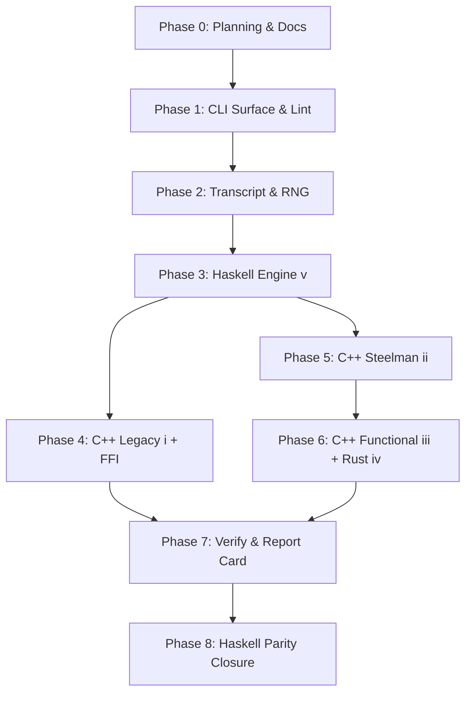

# MCTS Development Plan

**Status**: Authoritative source
**Supersedes**: N/A
**Referenced by**: [../README.md](../README.md), [../AGENTS.md](../AGENTS.md),
[../CLAUDE.md](../CLAUDE.md), [../HASKELL_CLI_TOOL.md](../HASKELL_CLI_TOOL.md),
[development_plan_standards.md](development_plan_standards.md),
[00-overview.md](00-overview.md), [system-components.md](system-components.md),
[legacy-tracking-for-deletion.md](legacy-tracking-for-deletion.md),
[phase-0-planning-documentation.md](phase-0-planning-documentation.md),
[phase-1-haskell-cli-surface.md](phase-1-haskell-cli-surface.md),
[phase-2-transcript-codec-and-determinism.md](phase-2-transcript-codec-and-determinism.md),
[phase-3-haskell-engine.md](phase-3-haskell-engine.md),
[phase-4-cpp-legacy-port-and-ffi-bridge.md](phase-4-cpp-legacy-port-and-ffi-bridge.md),
[phase-5-cpp-imperative-steelman.md](phase-5-cpp-imperative-steelman.md),
[phase-6-cpp-functional-and-rust.md](phase-6-cpp-functional-and-rust.md),
[phase-7-cross-backend-verify-and-report-card.md](phase-7-cross-backend-verify-and-report-card.md),
[phase-8-haskell-performance-parity-closure.md](phase-8-haskell-performance-parity-closure.md),
[../documents/documentation_standards.md](../documents/documentation_standards.md)
**Generated sections**: none

> **Purpose**: Provide the single execution-ordered development plan for the MCTS
> Haskell CLI and its five backends, including phase status, validation gates, and cleanup
> ownership across the bootstrap, engine buildout, FFI integration, cross-backend
> verification, and Haskell performance parity proof.

## Standards

See [development_plan_standards.md](development_plan_standards.md) for the maintenance
rules that govern this plan suite.

## Closure Status

Phase `0` Sprint `0.1` remains `Done` on plan-suite bootstrap. Phases `1` through
`7` are now `Active` on an implementation baseline: the worktree contains a Cabal
package, the `mcts` executable, the command registry and parser, generated command
documentation/manpage/completions, a deterministic transcript/cache layer, a simplified Corridors driver,
baseline equity-sidecar cache inspection/pruning, logical five-backend verification,
smoke-buildable foreign-backend placeholder trees,
and all five Cabal test-suite stanzas. The validation gate for this baseline remains
`cabal test all` under the pinned GHC `9.14.1` toolchain.

This is **not** the final parity-proven architecture. The implemented backend cohort is
a deterministic logical baseline used to validate the CLI, transcript, cache, and test
surfaces. The real sprint-owned remaining work is still explicit: the verbatim
`~/MCTS_legacy` port and Haskell FFI, the C++23 imperative and functional engines, the
Rust `cdylib`, the PGO+BOLT+`mimalloc` pipelines, the `ST` arena Haskell search engine,
the `brick` / `vty` TUIs, external legacy golden fixtures, and the Phase `8`
performance-parity proof remain open. Those surfaces stay `Active` / `Planned` rather
than being marked `Done` until their validation gates pass against the real artefacts.

## Document Index

| Document | Purpose |
|----------|---------|
| [development_plan_standards.md](development_plan_standards.md) | Conventions for maintaining the development plan |
| [00-overview.md](00-overview.md) | Vision, target outcome, doctrine scope, and hard constraints |
| [system-components.md](system-components.md) | Authoritative target component inventory for the MCTS Haskell CLI and its five backends |
| [phase-0-planning-documentation.md](phase-0-planning-documentation.md) | Phase 0: Planning and documentation topology |
| [phase-1-haskell-cli-surface.md](phase-1-haskell-cli-surface.md) | Phase 1: Haskell CLI surface, `CommandSpec`, lint stack |
| [phase-2-transcript-codec-and-determinism.md](phase-2-transcript-codec-and-determinism.md) | Phase 2: Transcript codec, RNG, and determinism contract |
| [phase-3-haskell-engine.md](phase-3-haskell-engine.md) | Phase 3: Backend (v) Haskell engine |
| [phase-4-cpp-legacy-port-and-ffi-bridge.md](phase-4-cpp-legacy-port-and-ffi-bridge.md) | Phase 4: Backend (i) C++ legacy port and FFI bridge |
| [phase-5-cpp-imperative-steelman.md](phase-5-cpp-imperative-steelman.md) | Phase 5: Backend (ii) C++ imperative steelman with PGO+BOLT |
| [phase-6-cpp-functional-and-rust.md](phase-6-cpp-functional-and-rust.md) | Phase 6: Backends (iii) C++ functional-style and (iv) Rust |
| [phase-7-cross-backend-verify-and-report-card.md](phase-7-cross-backend-verify-and-report-card.md) | Phase 7: Cross-backend verify, test stanzas, POC report card |
| [phase-8-haskell-performance-parity-closure.md](phase-8-haskell-performance-parity-closure.md) | Phase 8: Haskell performance parity closure and retirement protocol |
| [legacy-tracking-for-deletion.md](legacy-tracking-for-deletion.md) | Cleanup and retirement ledger |

## Status Vocabulary

| Status | Meaning | Emoji |
|--------|---------|-------|
| **Done** | Deliverables implemented for the sprint-owned surface, validated, and aligned in docs | ✅ |
| **Active** | Work has started and remaining implementation or documentation work is explicitly listed | 🔄 |
| **Planned** | Ready to start once execution reaches the sprint in sequence | 📋 |
| **Blocked** | Closure depends on an unmet prerequisite or prior sprint closure | ⏸️ |

## Definition of Done

A sprint can move to `Done` only when all of the following are true:

1. Its deliverables are implemented in the worktree.
2. Its validation commands pass through the canonical `mcts` surface (or, for Phase `0`,
   through the manual lint and grep audits named in this plan until Phase `1` lands the
   `mcts check-code` command).
3. The docs listed in `Docs to update` are aligned with the implemented behavior.
4. Sprint-owned cleanup or retirement entries are reflected in
   [legacy-tracking-for-deletion.md](legacy-tracking-for-deletion.md).
5. No sprint-owned blocker or remaining work survives.
6. The doctrine sections the sprint adopts (when any) are cited by name in the
   `Deliverables` block per standards rule L.

## Phase Overview

| Phase | Name | Status | Document |
|-------|------|--------|----------|
| 0 | Planning and Documentation Topology | 🔄 Active (Sprint 0.1 ✅; Sprint 0.2 📋) | [phase-0-planning-documentation.md](phase-0-planning-documentation.md) |
| 1 | Haskell CLI Surface, `CommandSpec`, Lint Stack | 🔄 Active (validated baseline; doctrine-complete lint stack still open) | [phase-1-haskell-cli-surface.md](phase-1-haskell-cli-surface.md) |
| 2 | Transcript Codec, RNG, and Determinism Contract | 🔄 Active (codec/cache/SHA-256/sidecar baseline; full envelope completion open) | [phase-2-transcript-codec-and-determinism.md](phase-2-transcript-codec-and-determinism.md) |
| 3 | Backend (v) Haskell Engine | 🔄 Active (logical engine baseline; ST arena/search parity engine open) | [phase-3-haskell-engine.md](phase-3-haskell-engine.md) |
| 4 | Backend (i) C++ Legacy Port and FFI Bridge | 🔄 Active (C ABI skeleton; verbatim legacy port/FFI open) | [phase-4-cpp-legacy-port-and-ffi-bridge.md](phase-4-cpp-legacy-port-and-ffi-bridge.md) |
| 5 | Backend (ii) C++ Imperative Steelman with PGO+BOLT | 🔄 Active (smoke skeleton; steelman engine and PGO+BOLT open) | [phase-5-cpp-imperative-steelman.md](phase-5-cpp-imperative-steelman.md) |
| 6 | Backends (iii) C++ Functional-Style and (iv) Rust | 🔄 Active (smoke skeletons; real engines and pipelines open) | [phase-6-cpp-functional-and-rust.md](phase-6-cpp-functional-and-rust.md) |
| 7 | Cross-Backend Verify, Test Stanzas, POC Report Card | 🔄 Active (test stanzas and logical verify pass; real cohort/TUIs/report-card evidence open) | [phase-7-cross-backend-verify-and-report-card.md](phase-7-cross-backend-verify-and-report-card.md) |
| 8 | Haskell Performance Parity Closure | 📋 Planned | [phase-8-haskell-performance-parity-closure.md](phase-8-haskell-performance-parity-closure.md) |

## Current Plan Status

The repository has moved past bootstrap into an active implementation baseline.
Implemented in the worktree:

- `mcts.cabal`, `cabal.project`, `app/Main.hs`, `src/MCTS/**`, `test/**`,
  `documents/cli/commands.md`, `share/man/man1/mcts.1`,
  `share/completion/{bash,zsh,fish}/`, `fourmolu.yaml`, `.hlint.yaml`, `.gitignore`.
- CLI command families: `bench`, `verify`, `inspect`, `test`, `lint`, `docs`,
  `commands`, `help`, `check-code`, `build`, and a non-interactive `play` smoke.
- Deterministic transcript encode/decode, cache root resolution, prefix lookup,
  action enumeration, move notation, `splitmix64` seed mixing, and baseline
  `.eq` / `.envelope` sidecar list/prune support.
- `inspect show --with-equity` writes a current logical equity sidecar, and
  `inspect divergence` now resolves the target transcript and renders metrics from
  `MCTS.Verify.Divergence` rather than a fixed placeholder.
- `inspect show --envelope` renders the current transcript envelope, and
  `mcts verify ... --allow-stale` is parsed and routed through the baseline layered
  envelope verifier for the fields present in the current envelope.
- Five Cabal test stanzas: `mcts-unit`, `mcts-integration`,
  `mcts-cross-backend`, `mcts-legacy-parity`, `mcts-haskell-style`.
- `mcts lint haskell` delegates to `cabal test mcts-haskell-style`, and
  `mcts check-code` runs lint/docs plus `cabal build all`.
- Smoke backend source homes under `cpp-legacy/`, `cpp-imperative/`,
  `cpp-functional/`, and `rust/`.

Remaining work is the difference between this baseline and the target end state:
full engine envelopes and foreign-engine recompute sidecars, the optimized Haskell `ST` arena engine,
real foreign C ABI bindings, the verbatim legacy port, PGO+BOLT pipelines, real
cross-backend bit-for-bit proof, interactive TUIs, external golden fixtures, and Phase
`8` performance parity closure.

The retirement protocol (i)→(ii)→(iii)→(v) named in [00-overview.md](00-overview.md) and
owned by Phase `8` is the long-running closure mechanism: each retiring backend's
recorded transcripts and throughput numbers freeze in `test/golden/` as the regression
anchor for the surviving cohort. Backend (iv) Rust stays as a long-running second opinion
throughout. Until Phase `8` closure, no backend retires and all five remain live.

## Sprint Dependencies

Phase `2` (transcript codec, RNG, determinism contract) gates every backend because the
wire format and the `splitmix64(master_seed, game_index)` per-game seed derivation are the
determinism contract every backend must honour. Phase `3` (Haskell engine) gates Phases
`4`–`6` because the FFI bridge from Haskell into the C ABI backends builds on the same
typed `Env` and `Subprocess` discipline established in Phase `1` and exercised by the
Haskell backend first. Phases `4`, `5`, and `6` then proceed in parallel after Phase `3`
closes — backend (i) is the regression-anchor port, backends (ii) and (iii) are the
performance ceiling and its functional sibling, and backend (iv) Rust is the
cross-language second opinion. Phase `7` joins the five backends in one round-robin
`mcts verify` cohort and emits the POC report card. Phase `8` closes the Haskell tuning
loop until backend (v) matches backend (ii) within tolerance on Q1 and Q2.

## Exit Definition

This plan is complete only when all of the following are true:

1. The repository holds five backends behind one `mcts` binary built by Cabal: backend
   (i) `cpp-legacy/`, (ii) `cpp-imperative/`, (iii) `cpp-functional/`, (iv) `rust/`, and
   (v) the native Haskell engine under `src/MCTS/`.
2. `mcts bench rollouts` and `mcts bench selfplay` produce comparable wall-clock numbers
   across all live backends from a single Cabal-driven monotonic clock
   (`Data.Time.Clock.getMonotonicTimeNSec`).
3. `mcts verify rollouts` and `mcts verify selfplay` agree bit-for-bit on visit counts
   across the live `(ii)..(v)` cohort under `--rng cpp`, with the `VerifyBackend` type
   excluding backend (i) at the type level.
4. `mcts verify legacy-parity` agrees on visit counts across all five backends under
   `max_plies = 10000` and the pinned fixture seed, with `LegacyParityBackend` requiring
   backend (i) at parse time.
5. `mcts test all` runs every Cabal test-suite stanza (`mcts-unit`, `mcts-integration`,
   `mcts-cross-backend`, `mcts-legacy-parity`, `mcts-haskell-style`) and emits the tidy
   report-card summary block answering Q1–Q7, with the report-card knobs `G_R=100_000`,
   `G_S=1_000`, `G_V=50`, `G_LP=10`, `S_BENCH=10_000`, `S_VERIFY=10_000`,
   `S_LP_SIMS=10_000`, `S_LP=42` pinned in `cabal.project`.
6. Pure Haskell backend (v) matches backend (ii) C++ steelman on Q1 (random rollouts) and
   Q2 (self-play) within the parity tolerance per
   [../documents/engineering/compiler_runtime_tuning.md → Parity Tolerance](../documents/engineering/compiler_runtime_tuning.md)
   (`HASKELL_PARITY_TOLERANCE = 0.05`), both single-threaded and on 8 workers.
   If Haskell falls short — including shortfalls in the 5–15% PGO-attributable band — the
   gap is recorded against the one-known-asymmetry PGO note in
   `documents/engineering/compiler_runtime_tuning.md` rather than papered over.
7. Same-backend determinism (Q4) holds for every backend across 3 seeds: same backend,
   same master seed, same RNG source produces identical transcripts under the
   `mcts-integration` stanza.
8. Backend (i) reproduces `MCTS_legacy` byte-for-byte on benchmark (b) (Q6), validated by
   the `test/golden/legacy/` fixture set written out-of-band from the legacy
   implementation under `~/MCTS_legacy`.
9. The retirement chain (i)→(ii)→(iii)→(v) closes, with frozen golden transcripts and
   throughputs in `test/golden/` as the surviving regression anchor for each retired
   backend; backend (iv) Rust remains live as the cross-language second opinion.
10. The toolchain is pinned at GHC `9.14.1` and Cabal `3.16.1.0`. `mcts.cabal` declares
    `tested-with: ghc ==9.14.1` and `cabal.project` declares `with-compiler: ghc-9.14.1`.
11. The Haskell stack uses `optparse-applicative`, `text`, `bytestring`, `aeson`,
    `prettyprinter`, `prettyprinter-ansi-terminal`, `ansi-terminal`, `path`, `path-io`,
    `typed-process`, `safe-exceptions`, `tasty`, `tasty-hunit`, `tasty-quickcheck`,
    `tasty-golden`, and `temporary` per the doctrine's standardized stack. The two
    deviations are `brick` + `vty` for the `play` and `inspect replay` TUIs only, and
    `dhall` is unused because daemon configuration is out of scope.
12. Library-first layout: `app/Main.hs` is thin and logic lives under `src/MCTS/`.
13. `mcts.cabal` declares the five test-suite stanzas with `type: exitcode-stdio-1.0` and
    `tasty` as the in-stanza runner.
14. `CommandSpec` is the source of truth for the parser, command tree
    (`mcts commands --tree`), JSON schema (`mcts commands --json`), markdown command
    reference, manpages, and shell completion scripts. The parser is a renderer of the
    spec, not the source of truth.
15. `Subprocess` is the only IO boundary for subprocess execution. `callProcess`,
    `readCreateProcess`, `System.Process` constructors, and `typed-process` smart
    constructors are hlint-forbidden outside the `runStreaming` / `capture` interpreter.
16. Every Plan/Apply command supports `--dry-run` and `--plan-file <path>` (`mcts test
    all`, the build harness, anything that mutates external state).
17. One `prerequisiteRegistry` spans every backend's toolchain (GCC, LLVM/BOLT, `rustc`,
    `mimalloc`, `ghcup`, the PGO/BOLT profile directories) and emits
    `AppError PrerequisiteUnmet` carrying the failing `nodeId`, description, and remedy
    hint.
18. Single `AppError` ADT with `renderError :: AppError -> Text` as the only Text
    rendering at the CLI boundary; `print`, `exitFailure`, and direct terminal formatting
    are hlint-forbidden outside `src/MCTS/CLI/Output.hs`.
19. `fourmolu.yaml` at repo root pins the twelve doctrine-mandated settings
    (`indentation`, `column-limit`, `function-arrows`, `comma-style`,
    `import-export-style`, `indent-wheres`, `record-brace-space`,
    `newlines-between-decls`, `haddock-style`, `let-style`, `in-style`, `unicode`); the
    `mcts-haskell-style` stanza enforces them plus the `cabal format` temp-file
    round-trip byte-equality check.
20. The transcript wire format is little-endian binary with no schema-library
    dependency: header carrying the run config, per-move records of
    `(action_id, visits)` sorted ascending by action ID, equity excluded. The canonical
    single-byte action enumeration in [system-components.md](system-components.md) is
    authoritative.
21. The transcript cache root resolves `--cache-dir <path>` → `$MCTS_CACHE_DIR` →
    `./.mcts-cache/` and is `.gitignore`'d when inside the project tree. Hash-prefix
    lookup is git-style: shortest unique prefix ≥ 4 hex chars; `AppError
    TranscriptNotFound` and `AppError TranscriptAmbiguous` cover the miss and ambiguous
    cases.
22. Equity is recomputed deterministically by the same backend during `inspect replay`
    and `inspect show --with-equity`; cross-backend equity equality is not asserted, only
    cross-backend visit-count equality.
23. The Docker development environment provides a single LLVM pinned in
    `docker/Dockerfile` shared by GHC `-fllvm` and BOLT; `docker compose up -d` plus
    `docker compose exec mcts bash` is the canonical entrypoint.
24. [legacy-tracking-for-deletion.md](legacy-tracking-for-deletion.md) contains no
    unresolved cleanup once Phase `8` closes and the retirement protocol completes; the
    `Completed` table preserves the retirement history.

## Related Documents

- [00-overview.md](00-overview.md)
- [development_plan_standards.md](development_plan_standards.md)
- [system-components.md](system-components.md)
- [legacy-tracking-for-deletion.md](legacy-tracking-for-deletion.md)
- [../HASKELL_CLI_TOOL.md](../HASKELL_CLI_TOOL.md)
- [../documents/documentation_standards.md](../documents/documentation_standards.md)
