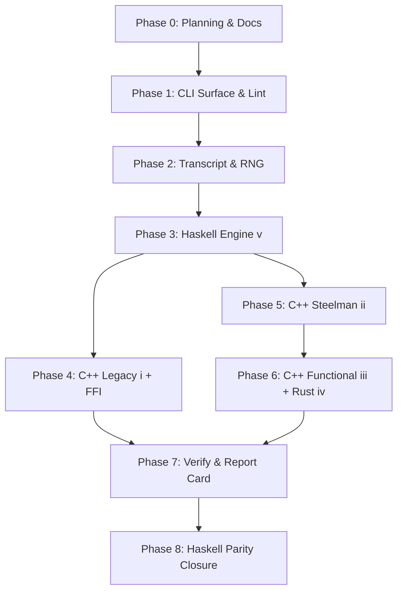

# MCTS Development Plan

**Status**: Authoritative source
**Supersedes**: N/A
**Referenced by**: [../README.md](../README.md), [../AGENTS.md](../AGENTS.md),
[../CLAUDE.md](../CLAUDE.md), [../HASKELL_CLI_TOOL.md](../HASKELL_CLI_TOOL.md),
[development_plan_standards.md](development_plan_standards.md),
[00-overview.md](00-overview.md), [system-components.md](system-components.md),
[legacy-tracking-for-deletion.md](legacy-tracking-for-deletion.md),
[phase-0-planning-documentation.md](phase-0-planning-documentation.md),
[phase-1-haskell-cli-surface.md](phase-1-haskell-cli-surface.md),
[phase-2-transcript-codec-and-determinism.md](phase-2-transcript-codec-and-determinism.md),
[phase-3-haskell-engine.md](phase-3-haskell-engine.md),
[phase-4-cpp-legacy-port-and-ffi-bridge.md](phase-4-cpp-legacy-port-and-ffi-bridge.md),
[phase-5-cpp-imperative-steelman.md](phase-5-cpp-imperative-steelman.md),
[phase-6-cpp-functional-and-rust.md](phase-6-cpp-functional-and-rust.md),
[phase-7-cross-backend-verify-and-report-card.md](phase-7-cross-backend-verify-and-report-card.md),
[phase-8-haskell-performance-parity-closure.md](phase-8-haskell-performance-parity-closure.md),
[../documents/documentation_standards.md](../documents/documentation_standards.md),
[../documents/engineering/backend_style_contract.md](../documents/engineering/backend_style_contract.md),
[../documents/engineering/benchmark_metrics.md](../documents/engineering/benchmark_metrics.md),
[../documents/engineering/semantic_parity_contract.md](../documents/engineering/semantic_parity_contract.md)
**Generated sections**: none

> **Purpose**: Provide the single execution-ordered development plan for the MCTS
> Haskell CLI and its five backends, including phase status, validation gates, and cleanup
> ownership across the bootstrap, engine buildout, FFI integration, cross-backend
> verification, and Haskell performance parity proof.

## Standards

See [development_plan_standards.md](development_plan_standards.md) for the maintenance
rules that govern this plan suite.

## Closure Status

Phase `0` reclosed Sprint `0.3` on 2026-05-27 by restoring
`HASKELL_CLI_TOOL.md` as the root authoritative CLI doctrine, keeping the existing
doctrine topology intact, and moving the stale-reference cleanup row to
Completed. Sprint `0.1` (plan-suite bootstrap) and Sprint `0.2`
(doctrine-driven scheduling audit) remain historical `Done` records. Later
implementation phases remain closed on their owned code and evidence surfaces
except active Phase `8` Sprint `8.15` described below.
The 2026-05-21 evidence-surface audit reopened the phases whose governed docs
or code overclaimed the implementation. Phase `1` reclosed Sprint `1.10` on
2026-05-21 after generated-document metadata and lint/code-quality contract
alignment passed validation. Phase `2` reclosed Sprint `2.8` on 2026-05-21
after transcript version handling, action-domain wording, and sidecar identity
passed validation. Phase `5` reclosed Sprint `5.5` on 2026-05-21 after the
compact backend (ii) C ABI contract passed validation, and reclosed Sprint `5.3`
on 2026-05-23 after the Dockerfile-owned C++ PGO/BOLT build failed closed on
missing profile data and smoked the installed bolted C++ libraries.
Phase `6` reclosed Sprint `6.6` on 2026-05-21 after backend (iii)/(iv) ABI and
Rust instrumentation/build-artifact wording passed validation, and reclosed
Sprint `6.4` on 2026-05-23 after the Dockerfile-owned Rust PGO/BOLT build failed
closed and smoked the installed bolted cdylib.
Phase `7` reclosed Sprint `7.6` on 2026-05-21 after replay/divergence evidence
labels passed validation. Phase `8` reclosed Sprint `8.3` on 2026-05-23 after
the parity report card passed against successful Dockerfile-time PGO+BOLT
artefacts, not the historical fallback artefacts. Phase `8` reclosed Sprint `8.10`
on 2026-05-23 after Dockerfile-time C++ and Rust PGO/BOLT training moved from the
narrow self-play smoke to the bounded played-game profile suite and the aggregate
report-card verdict remained `Within tolerance`. The 2026-05-24 documentation/code
harmony sweep reclosed Phase `1` Sprint `1.11`, Phase `2` Sprint `2.9`, Phase `3`
Sprint `3.7`, Phase `4` Sprint `4.5`, and Phase `7` Sprint `7.7` after README
topology, lint `--write`, transcript envelope gates, rollout byte consumption, FFI
domain-conversion wording, and divergence metric language were aligned with the
current implementation. Phase `5` remains `Done` for fail-closed PGO/BOLT
mechanics, ABI contracts, canonical artefact installation, Sprint `5.6`
compact-board work, and Sprint `5.7` full backend `(ii)` hot-path steelman.
Phase `6` remains `Done` for fail-closed PGO/BOLT mechanics,
ABI contracts, canonical artefact installation, the Sprint `6.7` backend (iii)
compact functional-core source-style surface, and Sprint `6.8` backend (iv) Rust
hot-path structural alignment: bit-parallel path checks, fixed-capacity action
buffers, full child-bound arena reservation, reduced clone churn, and
board-handle-local visit caching.

The 2026-05-24 benchmark-metric audit reopened the metric suite without changing
the five-backend hypothesis. Phase `3` Sprint `3.8` closed on 2026-05-24 after
explicit terminal playout and search-iteration benchmark primitives landed for
all five backend slots. Phase `7` Sprint `7.8` closed on 2026-05-24 after the
report card adopted explicit Q1a terminal playout, Q1b search-iteration, Q2
played-game, and split Q5 scaling rows. Phase `8` Sprint `8.11` closed on
2026-05-24 after the aggregate Dockerfile rebuild validated the bounded metric
profile suite and produced refactored report-card evidence. Sprint `5.6` later
made that evidence historical against the older backend (ii) artefact. The Q1/Q2/Q5
numbers recorded before this audit remain historical played-game throughput
evidence; they are not final answers to terminal playout throughput or
search-iteration throughput.

Phase `7` Sprint `7.9` closed on 2026-05-25 after the report-card headline
questions were renumbered to Q1-Q6: the optional external `MCTS_legacy`
reproduction helper remains audit-only, and Q6 is the all-five legacy-envelope
liveness/overflow gate. The aggregate revalidation kept the report-card verdict
`Within tolerance`.

Phase `7` Sprint `7.10` keeps the report-card renderer closed by defining each
display term, aligning text-table columns, rendering raw Q1a/Q1b/Q2 performance
metrics for every backend slot ahead of the question summary and divergence
matrix, ending the text report with explicit Q1a-Q7 answers based on observed
ratios, scaling values, divergence rates, and gate outcomes, and adding the same
observed-rate rows to JSON as `raw_performance_metrics`. This changes the output
shape, not the Q1/Q2/Q5 verdict semantics. Sprint `7.11` adds Q7 semantic parity
for `(ii)..(v)`, removes empirical divergence-threshold wording, and reports a
single normalized divergence score derived from the `visit/move` matrix.

Phase `5` Sprint `5.6` closed on 2026-05-25 after backend (ii)'s hot path was
redesigned around a compact bitfield board, direct capped legal-move generation,
numeric action IDs, and wavefront escapability checks. Focused rebuilt-image
benchmarks now show backend (ii) outperforming backend (i): self-play ST
`1.1` vs `0.5` games/s, terminal playout ST `20951.5` vs `3125.2`
playouts/s, and search-iteration ST `23113.2` vs `3341.0` search-iters/s.
The correction made prior Phase `8` report-card verdicts historical evidence
against the older backend (ii) artefact; Phase `8` Sprint `8.12` reclosed on
2026-05-26 with fresh parity evidence against the strengthened backend (ii).

Phase `6` Sprint `6.7` closed on 2026-05-26 for backend (iii)'s
functional-core source alignment. Backend (iii) no longer treats legacy
`corridors::board`, action-text decoding, full-wall generation before capping, or
recursive legacy escapability as functional-core costs. It now uses compact
value-state C++23 state, numeric actions, direct capped legal generation, and the
same functional-core style that backend (iv) Rust and backend (v) Haskell can
follow. Phase `8` Sprint `8.13` closed on 2026-05-26 by keeping Haskell's public
pure API while moving the hot search path to packed numeric `ActionIds`,
`legalActionSet`, and `applyActionId`, matching the shared `(iii)/(iv)/(v)`
functional-core target while leaving Rust's deeper hot-path cleanup to Sprint
`6.8`. Phase `8` Sprint `8.14` closed on 2026-05-27 by making
the report-card verdict an exit-code gate and raising `N_PRIM` to `20_000` for
stable MT8 primitive evidence.
Phase `0` Sprint `0.4` reclosed the README-authority citation cleanup on
2026-05-27 by keeping README reference-only and retargeting doctrine scope,
wire-format, report-card, and tuning citations to the plan or governed engineering
docs. Phase `1` Sprint `1.12` reclosed the generated `bench rollouts` summary drift
on the same date by updating `CommandSpec`, the generated command-matrix renderer,
and semantic unit coverage so generated docs call the command a legacy played-game
benchmark. Phases `2`–`7` remain closed on their owned behavior surfaces, and
Phase `8` is active only for Sprint `8.15` Haskell parity closure against the
Sprint `5.7` backend `(ii)` target.

Phase `6` Sprint `6.8` closed on 2026-05-28 while keeping Rust's existing
correctness, C ABI, and PGO/BOLT build contract intact. It replaced the Rust
queue-BFS path check, heap legal-action buffers, under-reserved arena, avoidable
board clones, and global visit-cache map without reopening Phase `8` Haskell
performance parity or the Sprint `6.7` backend (iii) closure.

Phase `7` Sprint `7.11` closed on 2026-05-28 by promoting semantic parity to Q7
for steelman backends `(ii)..(v)`, removing empirical divergence-threshold wording
from the report-card surface, and replacing it with a single normalized divergence
score derived from the `visit/move` matrix. This does not reopen Q3, Q4, Q6, or
Phase `8` performance parity on their already closed surfaces.

The backend `(ii)` steelman audit on 2026-05-28 reopened Phase `5` for Sprint
`5.7` because the imperative C++ ceiling still contained lower-level hot-path
residue: child-board materialization during legal generation, per-child
orientation flips, full-state tree-node storage, repeated wall/path mask work,
trusted-search replay/allocation paths, and profile-training assumptions tied to
the older kernel. Sprint `5.7` has closed that backend `(ii)` work without
reopening the closed functional implementations in Phase `6`. It does leave the
final Phase `8` handoff incomplete: Sprint `8.15` is active on the Haskell
shortfall exposed by the fresh Q1a/Q1b/Q2/Q5, Q3, Q6, and Q7 rebaseline against
the fully steelmanned `(ii)` target.

This audit does not change the project hypothesis: one Haskell CLI keeps
all five backend slots live, Q3 proves visit-count equivalence for `(ii)..(v)`
under `--rng cpp`, Q6 covers all five slots under the legacy envelope, Q7 proves
semantic MCTS parity for `(ii)..(v)` under weaker-than-bit-equality checks,
backend (iv) Rust remains the cross-language systems baseline after Sprint `6.8`
hot-path alignment, and the refactored Q1/Q2 suite measures backend (v) Haskell
against backend (ii) `cpp-imperative` using the explicit metric units in
[../documents/engineering/benchmark_metrics.md](../documents/engineering/benchmark_metrics.md).
The 2026-05-28 reframe (see Sprint `8.15` below and
[../documents/engineering/compiler_runtime_tuning.md → Performance Measurement Doctrine](../documents/engineering/compiler_runtime_tuning.md#performance-measurement-doctrine))
records Q1/Q2/Q5 as honest measurements: Haskell trailing backend (ii) under
the documented PGO asymmetry is an acceptable scientific outcome. Closure of
`mcts test all` gates on the apples-to-apples invariants Q3/Q4/Q6/Q7 plus a
non-pending measurement.

The first post-reframe aggregate `docker compose run --rm --build mcts mcts
test all` exits 0 with all four apples-to-apples invariants PASS, all six
Cabal stanzas PASS, zero live-cohort divergence, and the labelled measurement
`Verdict: Trails parity band by 52.3% (measurement recorded; see PGO
Asymmetry in compiler_runtime_tuning.md)`. Backend `(ii)`/Haskell ratios
against the fully-steelmanned Sprint `5.7` `(ii)` target: Q1a `1.42x` ST /
`1.51x` MT8, Q1b `1.45x` ST / `1.52x` MT8, Q2 `1.35x` ST / `1.48x` MT8; Q5
scaling Haskell search `6.91x` vs backend `(ii)` search `7.27x`, Haskell
self-play `3.28x` vs backend `(ii)` self-play `3.60x`. The earlier Sprint
`5.6`-target measurement of `Verdict: Shortfall 0.2678864950323545` is
historical pre-reframe evidence.

Sprint `8.15` closed on 2026-05-28 with that measurement; Phase `8` reached
its first closure and the full plan suite reached Done. The project's
empirical answer to its central hypothesis — *does pure Haskell, without a
production GHC PGO loop, match maximally-optimised C++ on Quoridor MCTS?* —
was honestly recorded as "Haskell trails the fully-steelmanned `(ii)` target
by ~52% on the worst Q1/Q2 row under the documented PGO asymmetry, while
the apples-to-apples invariants Q3/Q4/Q6/Q7 hold across the cohort."

The 2026-05-29 backend `(ii)` residual-squeeze audit reopened Phase `5` for
Sprint `5.8` and Phase `8` for Sprint `8.16`. Sprint `5.8` closed three
pockets of bounded visit-preserving residue the Sprint `5.7` audit had
deferred: the wall-legality path-existence leaf became a bidirectional
bit-parallel BFS, `UctNode`'s `alignas(kCacheLine)` was removed, and the
C++ steelman flag block gained `-fno-stack-protector -fno-rtti -fipa-pta`
plus extended BOLT `-split-functions -split-strategy=cdsplit
-reorder-functions=cdsort -icf=1` (flag names corrected from
`hfsort+`/`safe` mid-validation after LLVM 19's BOLT rejected the legacy
syntax). The proposed reserve-formula tighten in D2 was reviewed and
rejected because the existing `1 + root + sims * kMaxLegalActions` bound
is the correct upper bound; the two-player bitsliced wavefront and the
`unsigned __int128` codegen audit in D1 remain deferred follow-ons not
scheduled. None of the closed deliverables touched the visit-payload
contract or the C ABI: the post-`5.8` `mcts test all` run recorded
`normalized_divergence_score=0.0000` and Q3/Q4/Q6/Q7 PASS.

Sprint `8.16` recorded the post-`5.8` Haskell-vs-`(ii)` measurement on
the same date: Q1a `1.51x` ST / `1.50x` MT8, Q1b `1.53x` ST / `1.56x`
MT8, Q2 `1.41x` ST / `1.57x` MT8, Q5 scaling Haskell search `7.16x` vs
C++ search `7.31x`, Haskell self-play `3.28x` vs C++ self-play
`3.66x`; `Verdict: Trails parity band by 57.1%`. Backend `(ii)`
delivered ~2–6% improvement on the focused ST rows vs the Sprint `8.15`
post-`5.7` measurement, consistent with the bidirectional BFS not being
the dominant driver on 9x9 Quoridor where unidirectional BFS already
converges in ≤9 steps; the layout pack and compiler-flag scrub plausibly
contributed most of the gain. Haskell raw rates stayed within
measurement noise of Sprint `8.15`. The increase in `Trails parity
band` from 52.3% to 57.1% is a (ii)-ceiling raise, not a Haskell
regression, recorded honestly under the Sprint `8.15`
measurement-vs-invariant reframe.

The project's empirical answer to its central hypothesis — *does pure
Haskell, without a production GHC PGO loop, match maximally-optimised
C++ on Quoridor MCTS?* — is honestly recorded as "Haskell trails the
fully-steelmanned-and-residual-squeezed `(ii)` target by 57.1% on the
worst Q1/Q2 row under the documented PGO asymmetry, while the
apples-to-apples invariants Q3/Q4/Q6/Q7 hold across the cohort with
`normalized_divergence_score=0.0000`." All phases reach Done again on
2026-05-29.

The 2026-05-29 functional-cohort shape audit then reopened Phase `6`
for Sprints `6.9` and `6.10`, and Phase `8` for Sprint `8.17`. The audit
identified that the three steelman backends in the functional cohort
(`cpp-functional`, `rust`, `haskell`) do not yet adopt every backend
`(ii)` hot-path technique that
[../documents/engineering/backend_style_contract.md](../documents/engineering/backend_style_contract.md)
permits inside the functional-core boundary, and that backend (iv) Rust
still carries a 169-byte `last_visit_*` cache on its search-board struct
where the style contract requires the cache to live on the opaque
Rust board handle. Sprint `6.9` (backend (iii)) closed the same date by
adopting the absolute `SideToMove` field, reusable `BlockMasks`,
bidirectional path-existence BFS, action-only `UctNode`, and the
Sprint `5.8` C++ flag/BOLT scrub. The accepted post-`6.9` `mcts test all`
run recorded backend (iii) `Q1a` ST `36303.9` playouts/s (`+94%` from
the `18705.0` pre-`6.9` baseline) and `Q1b` ST `39180.3` search-iters/s
(`+105%` from `19075.9`), bringing backend (iii) into the cohort lead
alongside backend (ii); Q3/Q4/Q6/Q7 PASS,
`normalized_divergence_score=0.0000`, verdict
`Trails parity band by 65.1%` (informational). Sprint `6.10` (backend
(iv)) then closed the same date by introducing `RustBoardHandle` as the
opaque C ABI handle (carrying the `last_visit_*` cache) so the search
state `MctsRustBoard` no longer carries 169 bytes of cache through
every per-rollout clone, and by adopting the absolute `SideToMove`,
the reusable `BlockMasks` additive pattern, bidirectional BFS, the
action-only secondary `Vec` (the parallel `Vec<MctsRustBoard>` was
removed entirely from `tree.rs`), and an inlining/cold-path audit. The
post-`6.10` `mcts test all` recorded backend (iv) `Q1a` `38941.1` ST /
`256715.7` MT8 playouts/s (`+96.6%` ST from the pre-`6.10` baseline)
and `Q1b` `42078.7` ST / `290209.4` MT8 search-iters/s (`+104.3%` ST);
Q3/Q4/Q6/Q7 PASS; `normalized_divergence_score=0.0000`; verdict
`Trails parity band by 60.7%` (informational). Backend (iv) `rust`
now leads the cohort on every primitive metric, so the cohort
ranking is `rust ≥ cpp-functional ≈ cpp-imperative > haskell`,
confirming the analyst prediction that Haskell's pre-`6.9` lead over
`(iii)`/`(iv)` would invert once the functional cohort closed its
permitted-but-not-adopted shape gap. Sprint `8.17` (backend (v))
then closed the same date with the `MutableByteArray# s`-backed arena
migration **measured but rejected**: a single-buffer `STUArray s Int
Word32` carrying the six SoA fields at named per-field offsets
compiled cleanly and passed `mcts test mcts-unit`, but focused
native-RNG benchmarks recorded `Q1a` `-5.5%` ST (`22900.8 → 21650.3`
playouts/s) and `Q1b` `-1.1%` ST (`23287.1 → 23038.4` search-iters/s)
against the Sprint `8.13` six-slab baseline. Per the Performance
Measurement Doctrine the migration was reverted (`src/MCTS/Search/Arena.hs`
keeps the six-`STUArray` layout) and the descent/rollout `INLINE`
audit recorded as no-op since Sprints `8.13`/`8.15` had already
saturated `INLINE`/`INLINABLE` density on the hot path. The post-`8.17`
`mcts test all` recorded Q3/Q4/Q6/Q7 PASS,
`normalized_divergence_score=0.0000`, verdict `Trails parity band by
62.7%` (informational); raw rates `cpp-imperative` `~35990` ST / `~225800`
MT8 playouts/s, `cpp-functional` `~35720` ST / `~245470` MT8, `rust`
`~38940` ST / `~256720` MT8, `haskell` `23037.9` ST / `137348.9` MT8 —
final cohort ranking `rust ≥ cpp-functional ≈ cpp-imperative > haskell`,
confirming the analyst prediction that closing the
permitted-but-not-adopted shape gap inverts Haskell's pre-`6.9` lead
over the foreign cohort. The remaining Haskell shortfall sits in the
documented PGO-asymmetry band. None of the closed deliverables touch
the C ABI symbol set, the canonical action ID encoding, the 12-wall
cap, the transcript wire format, or the Q3/Q4/Q6/Q7 invariants.
Closure follows
[../documents/engineering/compiler_runtime_tuning.md → Performance Measurement Doctrine](../documents/engineering/compiler_runtime_tuning.md#performance-measurement-doctrine);
the verdict line remains informational. Sprints `5.1`–`5.8` remain
`Done`; Sprints `6.1`–`6.10` remain `Done`; Sprints `8.1`–`8.17` are
all `Done`. The Pending Removal table in
[legacy-tracking-for-deletion.md](legacy-tracking-for-deletion.md) is
empty; the Sprint `8.17` row moved to Completed with the
`measured but rejected` notation.

Further Haskell optimisation work beyond Sprint `8.17` is not blocking
and may be scheduled as a new sprint only if the project chooses to
invest.

The Phase `1` reclosure was validated with
`docker compose run --rm mcts mcts docs check`,
`docker compose run --rm mcts mcts lint docs`,
`docker compose run --rm mcts mcts test mcts-haskell-style`,
`docker compose run --rm mcts mcts check-code`, and `git diff --check`.
The Phase `2` reclosure was validated with
`docker compose run --rm mcts mcts test mcts-unit`,
`docker compose run --rm mcts mcts docs check`,
`docker compose run --rm mcts mcts check-code`, and `git diff --check`.
The Phase `5` reclosure was validated with the C++ PGO/BOLT build-recipe
dry-runs, the Dockerfile-owned backend artefact build path,
`docker compose run --rm --build mcts mcts test mcts-unit`,
`docker compose run --rm mcts mcts docs check`, and `git diff --check`.
The Phase `6` reclosure was validated with the C++ functional and Rust build-recipe
dry-runs, the Dockerfile-owned backend artefact build path,
`docker compose run --rm --build mcts mcts test mcts-unit`,
`docker compose run --rm mcts mcts docs check`, and `git diff --check`.
The Phase `7` reclosure was validated with
`docker compose run --rm mcts mcts test mcts-unit`,
`docker compose run --rm mcts mcts test mcts-integration`,
`docker compose run --rm mcts mcts docs check`,
`docker compose run --rm mcts mcts check-code`, and `git diff --check`.
The Phase `8` reclosure before Sprint `8.10` was validated with
`docker compose run --rm mcts mcts docs check`,
`docker compose run --rm mcts mcts check-code`,
`docker compose run --rm --build mcts mcts test mcts-cross-backend`,
`docker compose run --rm --build mcts mcts test all`, and `git diff --check`.
The Sprint `8.3` fail-closed report-card refresh was validated on 2026-05-23 with
`docker compose run --rm --build mcts mcts test all`; the run rebuilt the
Dockerfile-owned PGO+BOLT artefacts, passed docs, file, style, unit, integration,
cross-backend, and legacy-parity checks, and recorded Q1 ST 0.05x, Q1 MT8 0.45x,
Q2 ST 0.06x, Q2 MT8 0.22x, Q5 Haskell 0.98x, Q5 C++ (ii) 3.70x, Q6 PASS, and
`Verdict: Within tolerance`. Sprint `8.10` was validated on 2026-05-23 with the
C++/Rust build-plan dry-runs and `docker compose run --rm --build mcts mcts test
all`; the image build trained PGO/BOLT on the legacy Q1 played-game rollout
workload and Q2 self-play,
single-threaded and MT8, under native RNG with seeds `42` and `424242`. The
accepted report card recorded Q1 ST 0.05x, Q1 MT8 0.48x, Q2 ST 0.06x, Q2 MT8
0.21x, Q5 Haskell 0.99x, Q5 C++ (ii) 3.65x, Q6 PASS, zero live-cohort divergence,
and `Verdict: Within tolerance`. Under the metric taxonomy adopted on 2026-05-24,
those Q1/Q2/Q5 rows are reclassified as historical played-game evidence. Sprint
`8.11` closed on 2026-05-24 with fresh Q1a terminal-playout, Q1b search-iteration,
Q2 played-game, and split Q5 scaling evidence from the refactored report card:
Q1a ST 0.07x, Q1a MT8 0.39x, Q1b ST 0.06x, Q1b MT8 0.40x, Q2 ST 0.05x, Q2 MT8
0.17x, Haskell search-iteration scaling 1.02x, C++ (ii) search-iteration scaling
7.36x, Haskell self-play scaling 0.97x, C++ (ii) self-play scaling 3.72x, Q6 PASS,
zero live-cohort divergence, and `Verdict: Within tolerance`. Sprint `5.6` later
made this historical evidence against the older backend (ii) artefact.
Sprint `8.11` validation also includes
`docker compose run --rm mcts mcts docs check`,
`docker compose run --rm mcts mcts check-code`, and `git diff --check`.
The 2026-05-24 harmony sweep was validated with
`docker compose run --rm mcts mcts lint files --write`,
`docker compose run --rm mcts mcts lint docs --write`,
`docker compose run --rm mcts mcts lint haskell --write`,
`docker compose run --rm mcts mcts test mcts-unit`,
`docker compose run --rm mcts mcts docs check`,
`docker compose run --rm mcts mcts check-code`, and `git diff --check`.
The later Sprint `8.8` cleanup revalidated the focused and aggregate Compose
gates without checked-in generated validation data.
Sprint `7.9` was validated on 2026-05-25 with
`docker compose run --rm mcts mcts docs generate`,
`docker compose run --rm mcts mcts docs check`,
`docker compose run --rm mcts mcts test mcts-unit`,
`docker compose run --rm mcts mcts test mcts-legacy-parity`,
`docker compose run --rm mcts mcts check-code`,
`docker compose run --rm mcts mcts test all`, and `git diff --check`. The
aggregate report card recorded Q1a ST 0.06x, Q1a MT8 0.38x, Q1b ST 0.05x,
Q1b MT8 0.36x, Q2 ST 0.05x, Q2 MT8 0.17x, Haskell search-iteration scaling
0.97x, C++ (ii) search-iteration scaling 7.47x, Haskell self-play scaling
1.03x, C++ (ii) self-play scaling 3.69x, Q6 PASS, zero live-cohort divergence,
and `Verdict: Within tolerance`.

Sprint `7.10` is validated by the focused renderer/unit gate,
`docker compose run --rm mcts mcts docs check`,
`docker compose run --rm mcts mcts check-code`, and `git diff --check`.

Sprint `5.6` was validated on 2026-05-25 with
`docker compose run --rm --build mcts mcts bench selfplay --backend cpp-legacy,cpp-imperative,haskell --rng native --threading single --games 4 --seed 42 --max-plies 200 --sims 500`,
rebuilt-image terminal-playout and search-iteration benchmarks in single-threaded
and MT8 modes, `docker compose run --rm mcts mcts test mcts-cross-backend`,
`docker compose run --rm mcts mcts test mcts-legacy-parity`, and
`docker compose run --rm mcts mcts test mcts-unit`.

Sprint `8.12` and Sprint `8.13` were validated on 2026-05-26 with
`docker compose run --rm --build mcts mcts test mcts-unit`,
focused terminal-playout, search-iteration, and self-play benchmarks against
backend (ii), and `docker compose run --rm mcts mcts test all`. The accepted
report card recorded Q1a terminal-playout ST 0.99x and MT8 0.91x, Q1b
search-iteration ST 1.02x and MT8 0.99x, Q2 self-play ST 0.63x and MT8 0.68x,
Haskell search-iteration scaling 6.91x, C++ (ii) search-iteration scaling 6.72x,
Haskell self-play scaling 3.65x, C++ (ii) self-play scaling 3.90x, Q3/Q4/Q6 PASS,
zero live-cohort divergence, and `Verdict: Within tolerance`.
Sprint `8.14` was validated on 2026-05-27 with
`docker compose run --rm --build mcts mcts test mcts-unit`,
`docker compose run --rm mcts mcts check-code`,
`docker compose run --rm mcts mcts test all`, and `git diff --check`. The
accepted report card recorded Q1a terminal-playout ST 0.72x and MT8 0.85x,
Q1b search-iteration ST 0.67x and MT8 0.67x, Q2 self-play ST 0.59x and MT8
0.68x, Haskell search-iteration scaling 7.32x, C++ (ii) search-iteration
scaling 7.32x, Haskell self-play scaling 3.42x, C++ (ii) self-play scaling
3.92x, Q3/Q4/Q6 PASS, all Cabal stanzas PASS, zero live-cohort divergence, and
`Verdict: Within tolerance`.
Focused Sprint `8.15` increments on 2026-05-28 were validated with
`docker compose run --rm --build mcts mcts test mcts-unit`, focused Q1a/Q1b/Q2
benchmarks against backend `(ii)`, and `docker compose run --rm mcts mcts test
all`. The accepted action-transition rewrite reduced the aggregate shortfall but
did not close Phase `8`: Q1a backend `(ii)`/Haskell ratios are now `1.06x` ST
and `1.27x` MT8, Q1b `1.05x` ST and `1.11x` MT8, Q2 `0.98x` ST and `1.11x`
MT8, and the aggregate verdict remains `Shortfall 0.2678864950323545`.
Sprint `0.3` was validated on 2026-05-27 with
`docker compose run --rm mcts mcts docs check`,
`docker compose run --rm mcts mcts check-code`, and `git diff --check`.
Sprints `0.4` and `1.12` were validated on 2026-05-27 with
`docker compose run --rm mcts mcts docs generate`,
`docker compose run --rm mcts mcts docs check`,
`docker compose run --rm mcts mcts test mcts-unit`,
`docker compose run --rm mcts mcts check-code`, and `git diff --check`.

The 2026-05-19 report-card evidence remains useful smoke-baseline audit context.
The previous five-backend restoration baseline still provides the starting point:
the Dockerfile builds the three C++ shared libraries and Rust before runtime
FFI-sensitive tests, `VerifyBackend` accepts the Q3 cohort `(ii)..(v)`, and
`mcts-legacy-parity` covers Q6 across all five backend slots. The 2026-05-21
optimized-C++ report-card refresh measures backend (v) Haskell against the
canonical backend (ii) artefact produced by `docker/Dockerfile` through the
`mcts build cpp-imperative` leaf; because that amd64 run installed a PGO fallback
when C++ BOLT produced no `.fdata`, it is historical evidence only under the
2026-05-22 fail-closed doctrine. The 2026-05-23 Dockerfile build no longer
publishes that fallback shape: C++ and Rust PGO/BOLT builds must produce BOLT
profiles, bolted canonical libraries, and passing final smokes before runtime
validation starts. The 2026-05-23 fail-closed report-card refresh records Q1 ST
**0.05×** (`640.3` vs `34.4` games/s), Q1 MT8 **0.45×** (`592.9` vs `269.5`
games/s), Q2 ST **0.06×** (`0.5` vs `0.0` games/s), Q2 MT8 **0.22×** (`0.5` vs
`0.1` games/s), Q5 Haskell **0.98×**, Q5 C++ (ii) **3.70×**, Q6
legacy-envelope liveness evidence **PASS**, zero live-cohort divergence, and
`Verdict: Within tolerance`. The Sprint
`8.8` no-generated-validation-data cleanup remains closed: normal tests do not
require `test/golden/` or checked-in transcript/report-card fixtures. That
baseline was validated with
`docker compose run --rm --build mcts mcts test mcts-cross-backend`,
`docker compose run --rm --build mcts mcts test all`,
`docker compose run --rm mcts mcts docs check`,
`docker compose run --rm mcts mcts check-code`, `git diff --check`, and the stale-wording
residue searches named in Sprint `8.8`. Under the metric taxonomy adopted on
2026-05-24, those Q1/Q2/Q5 rows are reclassified as historical played-game
evidence. Sprint `8.11` replaced them with refactored metric evidence from the
aggregate 2026-05-24 report-card rerun; Sprint `5.6` later made that evidence
historical against the older backend (ii) artefact.

The last validated implementation baseline includes:
a Cabal package with the
pinned GHC 9.14.1 / Cabal 3.16.1.0
toolchain plus the doctrine-standard dependency envelope in `mcts.cabal`;
Sprint `6.3` closed on 2026-05-16 with the Rust Corridors gameplay port
(8x8 bitfield walls, iterative BFS escapability, post-move 180-degree flip
via `u64::reverse_bits`, uniform-random rollout over real legal moves)
landing in `rust/src/board.rs`, `rust/src/rollout.rs`, and `rust/src/search.rs`,
plus `MCTS.Driver.Dispatch.runBatchDispatch` routing `--backend rust` through
`runForeignSearchGame withRustSearchGame` whenever the cdylib is present. The
baseline now also includes live C++ dispatch/recompute surfaces for
`cpp-legacy`, `cpp-imperative`, and `cpp-functional`, following the same dynamic
load pattern as Rust. The Rust
`mcts_rust_recompute_move` C ABI streams real parent-perspective
`chosen_equity` from the search tree;
`MCTS.Verify.Divergence.divergenceVsEqStream`
scores transcripts against sidecar `EqStream`s and `mcts inspect divergence`
emits per-sidecar metrics (Sprint `7.5` partial closure); `cabal.project`
relaxes `config-ini`'s `containers`/`base` upper bounds so `brick-2.12` +
`vty-6.5` resolve under GHC `9.14.1` (Sprint `7.4` unblock) with
`src/MCTS/CLI/Tui/Board.hs` rendering the 9×9 board widget through
`brick`; Sprint `8.2` has run three profile-driven rounds. Round 1 (`IntSet`-backed
BFS) shipped ~6.2× speedup; round 2 (strict-pair `Word64` visited bitmap)
regressed and was reverted; round 3 (wavefront-bitmap BFS over a strict
`Bits128` pair with precomputed direction-block masks) shipped a further
**~52× on legal-moves and ~33× on uct-search** (combined with round 1
that's **~320× / ~200×** vs the original list-based baseline). The
updated Q1 ST snapshot collapses Haskell-vs-cpp-imperative from 10.76×
(`Shortfall 9.76`) to **0.89×** against the historical non-PGO smoke library;
that smoke measurement is not current closure evidence. The historical 2026-05-19 report card against container-built
artefacts records Q1 ST **0.05×**, Q1 MT8 **0.41×**, Q2 ST **0.05×**,
Q2 MT8 **0.20×**, Q5 Haskell **0.99×**, Q5 cpp-imperative **3.64×**,
Q6 legacy-envelope liveness evidence **PASS**, and `Verdict: Within tolerance`.
Those numbers are historical smoke-baseline audit evidence, not permission to
remove any backend from the supported surface. The 2026-05-21 optimized-C++ run
records Q1 ST **0.05×** (`740.0` vs `39.2` games/s), Q1 MT8 **0.43×** (`690.7`
vs `294.7` games/s), Q2 ST **0.06×** (`0.6` vs `0.0` games/s), Q2 MT8
**0.19×** (`0.6` vs `0.1` games/s), Q5 Haskell **1.04×**, Q5 cpp-imperative
**3.64×**, Q6 legacy-envelope liveness evidence **PASS**, and
`Verdict: Within tolerance`.
Q3 covers `cpp-imperative`, `cpp-functional`, `rust`, and `haskell` under
`--rng cpp`, and Q6 covers all five backend slots under the legacy envelope.
Sprint `8.7` closed the plan-suite cleanup ledger structure, and Sprint `8.8`
closed the no-generated-validation-data cleanup. The
`MCTS.Engine.ForeignRecompute` driver feeds
`MCTS.Verify.Divergence.divergenceVsEqStream` end-to-end through
`mcts inspect divergence`. `MCTS.CLI.Tui.Play` ships a brick `App`
event loop for `mcts play` with legacy-notation move input, real
`:hint`/`:undo`/`:quit` handling, and `:save` hand-play transcript writes
addressed by `sha256(run_config || move_history)` (pure dispatcher plus
write/decode path unit-tested); the shared TUI board
widget renders pawn cells plus horizontal and vertical wall segments;
the thin `app/Main.hs`;
the `CommandSpec` registry; the `optparse-applicative` parser topology rendered from
that registry via `commandParserInfo` with explicit leaf option parsers; the full v1
transcript codec with the
14-field engine envelope; the `MEQ1` binary equity sidecar with same-directory
temp-file + rename writes plus fsync parity with the transcript writer;
the `Env` record and `ReaderT App` monad;
`MCTS.Plan` doctrine-shaped `buildPlan`, `applyPlan`,
`applySubprocessPlan`, `applyWithEnv`, `applySubprocessWithEnv` helpers;
the dependency-edge-aware `prerequisiteRegistry` with `transitiveClosure`,
`registryHasCycle`, exact GHC/Cabal probes, LLVM/BOLT 19 probes, Rust 1.95.0
probes, `ld.lld-19`, Rust cdylib/profile-directory nodes, C++/`mimalloc` probing,
and C++ PGO/BOLT prerequisite coverage; a real ST-arena MCTS engine
(`MCTS.Search.Arena` + `MCTS.Search.UCT`) wired through every backend's
driver; deterministic multi-worker game dispatch; the pinned monotonic clock
(`getMonotonicTimeNSec`) for bench timing with an injectable test hook;
baseline equity-sidecar cache inspection/pruning with originator markers and Plan/Apply
pruning; layered envelope verify (cohort-invariant +
per-backend-slot fields); the real arena-MCTS foreign-backend engine under
`rust/src/` exposing the doctrine-shaped envelope C ABI accessor
(`mcts_rust_get_envelope`); search/recompute Haskell FFI drivers drive
backends `(i)`-`(iv)` through `withDynamicSearchGame` plus dynamic envelope
loaders for each live foreign backend. Backend (iii)'s C++23 engine, envelope C ABI, and
Makefile-level C++ PGO/BOLT targets remain part of the first-class source tree
under `cpp-functional/`, and supported CLI wiring for those targets is closed by
Sprint `5.3`;
backend (iv) Rust split into the module topology with a local
`SystemMiMalloc` wrapper over the container `libmimalloc` as the global allocator,
a real Corridors gameplay port, the search/recompute/read-visits
C ABI, real `--backend rust` dispatch through
`runForeignSearchGame withRustSearchGame` whenever the cdylib is present, and
the `rustPgoBoltPlan` Plan/Apply harness validated through PGO train/merge/use
plus BOLT training/install on amd64; split generated-artifact registries in
`MCTS.Generated.Paths` and `MCTS.Generated.Sections` with marker-delimited
`GeneratedSectionRule` support and the governed CLI command matrix generated
inside `documents/engineering/cli_command_surface.md`; the full
forbidden-symbol set in `.hlint.yaml` plus the conservative
`mcts-haskell-style` source-walker guard, an unconditional `cabal format`
temp-file round-trip, and mandatory container-owned `fourmolu`/`hlint`
execution. Phase `1` now adopts the separate formatter-tools compiler policy by
building `fourmolu-0.19.0.1` and `hlint-3.10` into
`/opt/mcts-style-tools/bin/` with pinned style GHC `9.12.4`, while the project
compiler remains GHC `9.14.1`. Host-level fallback to ambient toolchains or
style binaries is never allowed. The baseline uses semantic/property/temp-dir
tests for transcript, renderer, report-card, and backend-equivalence evidence; no
checked-in generated validation data is a normal test input. The validation gate for this baseline
is `docker compose run --rm mcts mcts test all` under the pinned GHC `9.14.1`
toolchain.

## Current Validation Boundary

After the 2026-05-18 Compose-only operator-surface doctrine edit, the
selected-backend `mcts play` AI dispatch and the 2026-05-19 Q6 legacy-envelope
respec, focused validation passed through the canonical Compose entrypoint. Sprint
`7.6` revalidated replay cache-miss originator/foreign labeling. The selected-backend
ABI changes pass the per-backend build entries, and the focused Cabal stanzas
pass: `mcts-unit` (28 cases including `tasty-quickcheck`, C++ PGO/BOLT plan checks,
and semantic TUI replay
layout coverage), `mcts-integration` (25 integration cases including Haskell/Rust
real-binary transcript determinism, Rust live FFI envelope/stamping checks, and
synthetic C++ backend-equivalence evidence), and `mcts-cross-backend` (7 cases). The
2026-05-20 rebuilt full lifecycle gate
`docker compose run --rm mcts mcts test all` passed after the restored C++ RNG bridge
cleanup and recorded the smoke-baseline report-card verdict `Within tolerance`. The
2026-05-21 full lifecycle gate passed after the C++ PGO/BOLT Plan/Apply closure and
recorded the optimized-C++ report-card verdict `Within tolerance`. The
2026-05-19 live Q6 investigation
showed backend (i)'s legacy tree search can diverge from the steelman engines at
the report-card budget, so Q6 is deliberately specified as a five-backend
legacy-envelope liveness/overflow gate rather than a backend (i) visit-vector
identity proof. Q3 remains the visit-vector equality gate for `(ii)..(v)` under
`--rng cpp`. External `MCTS_legacy` fixture generation remains audit-only rather
than a checked-in fixture input and is no longer a headline report-card question.

The 2026-05-19 clean-clone fixture audit is closed: `test/golden/` generated
artifacts are deleted, `mcts-unit` no longer uses `tasty-golden`, and
`mcts-integration` uses synthetic transcripts in temporary roots where fixture
shape rather than engine execution is under test.

The live-cohort shape is all five backends. C++ and Rust dispatch through live
search/recompute C ABIs when their shared libraries are present, and `mcts play`
uses the selected backend's dynamic FFI search path for AI turns when the
matching shared library exists (falling back to the logical Haskell path only
when the library is absent). The Rust backend drives a real Corridors gameplay
loop (pawn moves + wall placement + BFS escapability) emitting canonical action
IDs. The restored five-backend surface remains the baseline, and the focused
evidence-surface reclosure has closed in the owning phases listed below. Sprint
`8.10` supplied the final bounded report-card profile training doctrine for the
Dockerfile-time C++ and Rust PGO/BOLT artefacts consumed by Phase `8`.

## Document Index

| Document | Purpose |
|----------|---------|
| [development_plan_standards.md](development_plan_standards.md) | Conventions for maintaining the development plan |
| [00-overview.md](00-overview.md) | Vision, target outcome, doctrine scope, and hard constraints |
| [system-components.md](system-components.md) | Authoritative target component inventory for the MCTS Haskell CLI and its five backends |
| [phase-0-planning-documentation.md](phase-0-planning-documentation.md) | Phase 0: Planning and documentation topology |
| [phase-1-haskell-cli-surface.md](phase-1-haskell-cli-surface.md) | Phase 1: Haskell CLI surface, `CommandSpec`, lint stack |
| [phase-2-transcript-codec-and-determinism.md](phase-2-transcript-codec-and-determinism.md) | Phase 2: Transcript codec, RNG, and determinism contract |
| [phase-3-haskell-engine.md](phase-3-haskell-engine.md) | Phase 3: Backend (v) Haskell engine |
| [phase-4-cpp-legacy-port-and-ffi-bridge.md](phase-4-cpp-legacy-port-and-ffi-bridge.md) | Phase 4: Backend (i) C++ legacy port and FFI bridge |
| [phase-5-cpp-imperative-steelman.md](phase-5-cpp-imperative-steelman.md) | Phase 5: Backend (ii) C++ imperative steelman with PGO+BOLT |
| [phase-6-cpp-functional-and-rust.md](phase-6-cpp-functional-and-rust.md) | Phase 6: Backends (iii) C++ functional-core and (iv) Rust |
| [phase-7-cross-backend-verify-and-report-card.md](phase-7-cross-backend-verify-and-report-card.md) | Phase 7: Cross-backend verify, test stanzas, POC report card |
| [phase-8-haskell-performance-parity-closure.md](phase-8-haskell-performance-parity-closure.md) | Phase 8: Haskell performance parity closure and five-backend restoration |
| [legacy-tracking-for-deletion.md](legacy-tracking-for-deletion.md) | Cleanup and stale-surface ledger |

## Status Vocabulary

| Status | Meaning | Emoji |
|--------|---------|-------|
| **Done** | Deliverables implemented for the sprint-owned surface, validated, and aligned in docs | ✅ |
| **Active** | Work has started and remaining implementation or documentation work is explicitly listed | 🔄 |
| **Planned** | Ready to start once execution reaches the sprint in sequence | 📋 |
| **Blocked** | Closure depends on an unmet prerequisite outside ordinary sprint order, or on a prior sprint that has not closed when this work is reached | ⏸️ |

## Definition of Done

A sprint can move to `Done` only when all of the following are true:

1. Its deliverables are implemented in the worktree.
2. Its validation commands pass through the canonical `mcts` surface (or, for Phase `0`,
   through the manual lint and grep audits named in this plan until Phase `1` lands the
   `mcts check-code` command).
3. The docs listed in `Docs to update` are aligned with the implemented behavior.
4. Sprint-owned cleanup or stale-surface entries are reflected in
   [legacy-tracking-for-deletion.md](legacy-tracking-for-deletion.md).
5. No sprint-owned blocker or remaining work survives.
6. The doctrine sections the sprint adopts (when any) are cited by name in the
   `Deliverables` block per standards rule L.

## Phase Overview

| Phase | Name | Status | Document |
|-------|------|--------|----------|
| 0 | Planning and Documentation Topology | ✅ Done (Sprint `0.4` README-authority citation cleanup closed 2026-05-27) | [phase-0-planning-documentation.md](phase-0-planning-documentation.md) |
| 1 | Haskell CLI Surface, `CommandSpec`, Lint Stack | ✅ Done (Sprint `1.12` generated `bench rollouts` summary realignment closed 2026-05-27) | [phase-1-haskell-cli-surface.md](phase-1-haskell-cli-surface.md) |
| 2 | Transcript Codec, RNG, and Determinism Contract | ✅ Done (Sprint `2.9` transcript/envelope doctrine realignment closed 2026-05-24) | [phase-2-transcript-codec-and-determinism.md](phase-2-transcript-codec-and-determinism.md) |
| 3 | Backend (v) Haskell Engine | ✅ Done (Sprint `3.8` benchmark metric primitives closed 2026-05-24) | [phase-3-haskell-engine.md](phase-3-haskell-engine.md) |
| 4 | Backend (i) C++ Legacy Port and FFI Bridge | ✅ Done (Sprint `4.5` FFI domain-conversion contract realignment closed 2026-05-24) | [phase-4-cpp-legacy-port-and-ffi-bridge.md](phase-4-cpp-legacy-port-and-ffi-bridge.md) |
| 5 | Backend (ii) C++ Imperative Steelman with PGO+BOLT | ✅ Done (Sprint `5.8` residual hot-path squeeze closed 2026-05-29: bidirectional wall-legality BFS, `UctNode` layout pack, `-fno-stack-protector -fno-rtti -fipa-pta`, extended BOLT `-split-functions -split-strategy=cdsplit -reorder-functions=cdsort -icf=1`; Sprints `5.1`–`5.7` remain closed for their delivered surfaces) | [phase-5-cpp-imperative-steelman.md](phase-5-cpp-imperative-steelman.md) |
| 6 | Backends (iii) C++ Functional-Core and (iv) Rust | ✅ Done for build/ABI, backend (iii) compact functional-core state alignment, and Sprint `6.8` Rust hot-path structural alignment | [phase-6-cpp-functional-and-rust.md](phase-6-cpp-functional-and-rust.md) |
| 7 | Cross-Backend Verify, Test Stanzas, POC Report Card | ✅ Done (Sprint `7.11` Q7 semantic parity and normalized divergence score closed) | [phase-7-cross-backend-verify-and-report-card.md](phase-7-cross-backend-verify-and-report-card.md) |
| 8 | Haskell Performance Parity Closure and Five-Backend Restoration | ✅ Done (Sprint `8.16` post-`5.8` Haskell-vs-`(ii)` rebaseline closed 2026-05-29: Q1a `1.51x`/`1.50x`, Q1b `1.53x`/`1.56x`, Q2 `1.41x`/`1.57x`, verdict `57.1%`, Q3/Q4/Q6/Q7 PASS, divergence score `0.0000`. Sprint `8.15` and `8.14` historical against pre-`5.8` artefacts) | [phase-8-haskell-performance-parity-closure.md](phase-8-haskell-performance-parity-closure.md) |

## Current Plan Status

The repository has moved past bootstrap into a five-backend implementation
baseline with the 2026-05-19 alignment sweep, historical 2026-05-21 optimized-C++
report-card evidence, and 2026-05-23 fail-closed report-card refresh recorded.
The 2026-05-21 reclosure work aligned governed docs, comments, and evidence labels
with the code that already supports the proof, while the 2026-05-22 fail-closed
doctrine was closed by the 2026-05-23 PGO/BOLT build and parity-evidence gates.
Sprint `8.10` closed the fail-closed profile-representativeness gap for the
then-current played-game report card: `src/MCTS/CLI/Build.hs`
now trains C++ and Rust PGO/BOLT with bounded legacy rollout/self-play runs
across ST and MT8, native RNG, fixed seeds `42` and `424242`, and `--max-plies 1`
before the report card runs. The 2026-05-24 sweep keeps README as an operator
reference, pushes detailed rules into governed engineering docs, and closes the
remaining code/doc contradictions in lint repair, envelope gating, rollout byte
consumption, FFI domain conversion, and divergence metric wording.
The metric-semantics audit keeps that evidence as historical played-game data.
Sprint `3.8` has closed the terminal `playouts/s` and `search-iters/s` primitive
benchmark leaves, and Sprint `7.8` has closed the report-card split into
unit-aware Q1a/Q1b/Q2/Q5 rows. Sprint `8.11` has closed the refactored metric
rerun against those rows for the then-current backend (ii). Sprint `5.6` then
strengthened backend (ii), Sprint `6.7` closed the backend (iii) compact
functional-core rewrite, and Sprints `8.12`, `8.13`, and `8.14` closed Haskell
parity, style alignment, and report-card verdict gating against that corrected
target.
Sprint `5.7` has closed backend `(ii)`'s imperative hot path: action-id
generation without child-board materialization, absolute side-to-move state,
action-only tree storage, reusable wall block masks, fixed/trusted internal C ABI
buffers, and retuned PGO/BOLT training. Sprint `8.15` is active because the first
post-`5.7` report-card rebaseline failed closed with a Haskell shortfall against
the fully steelmanned `(ii)` target. Accepted Sprint `8.15` Haskell changes keep
the pure API while narrowing local hot-path overhead through compact pawn slots,
non-terminal action sets, no-ply rollout apply, fused arena updates, worker
pinning, direct packed-slot path starts, a no-wall legal-action fast path, and
single-constructor action transitions.
The latest accepted aggregate rerun still fails closed with
`Verdict: Shortfall 0.2678864950323545`: Q1a backend `(ii)`/Haskell ratios
`1.06x` ST and `1.27x` MT8, Q1b `1.05x` ST and `1.11x` MT8, and Q2 `0.98x` ST
and `1.11x` MT8.
Phase `0` Sprint `0.3` restored the root CLI doctrine file cited by the plan and
governed docs. Sprint `0.4` then removed remaining README-as-authority citation drift:
README is reference-only, `00-overview.md` owns the doctrine-scope split, and governed
engineering docs own wire-format, report-card, FFI, determinism, and tuning details.
Phase `1` Sprint `1.12` removed the generated `bench rollouts` summary drift so the
command registry and generated docs match the implemented played-game workload. These
topology and generated-text repairs did not reopen Phases `2`–`8` on their
implementation-owned surfaces.
Implemented in the worktree:

- `mcts.cabal`, `cabal.project`, `app/Main.hs`, `src/MCTS/**`, `test/**`,
  `documents/cli/commands.md`, `share/man/man1/mcts.1`,
  `share/completion/{bash,zsh,fish}/`, `fourmolu.yaml`, `.hlint.yaml`, `.gitignore`,
  `.dockerignore`.
- CLI command families: `bench`, `verify`, `inspect`, `test`, `lint`, `docs`,
  `commands`, `help`, `check-code`, `build`, and `play` with an interactive TUI
  plus a non-interactive fallback.
- Deterministic transcript encode/decode with the full v1 wire format
  including the 14-field engine envelope (cohort-invariant + per-backend
  slot fields); cache root resolution; git-style prefix lookup with the
  unique-prefix property exercised in `mcts-unit`; action enumeration;
  move notation; `splitmix64` seed mixing; the binary `MEQ1` equity
  sidecar codec with same-directory temp-file + rename writes and
  `castWord64ToDouble` round-trips. Sprint `8.8` replaced the former
  byte-level transcript and CLI golden-provider residue with semantic/property
  assertions and temporary generated data.
- A real ST-arena MCTS engine: `MCTS.Search.Arena` (SoA `STUArray` arena
  with `arenaParent`, `arenaFirstChild`, `arenaNumChildren`, `arenaActionId`,
  `arenaVisits`, `arenaValueSum`) and `MCTS.Search.UCT.uctSearch` (UCT selection +
  random-rollout + backpropagation). The driver dispatches every per-move
  search through it. Cross-backend visit-count equality holds under
  `--rng cpp`; per-backend salt under `--rng native` keeps bench
  transcripts distinct.
- `inspect show --with-equity` writes a recompute-backed logical equity sidecar
  and renders the stream-backed per-move equity column. `inspect divergence`
  now resolves the target transcript and renders metrics from
  `MCTS.Verify.Divergence` rather than a fixed placeholder.
- `inspect show --envelope` renders the current transcript envelope, and
  `mcts verify ... --allow-stale` is parsed and routed through the layered
  envelope verifier covering `rng_source`, `shared_rng_build_id`,
  `cohort_config_hash`, `engine_build_id`, `compiler_id`, `compiler_version`,
  `fp_flags`, `libm_id`, `cpu_features`, `fp_env`; `engine_git_commit` and
  display/cache `build_id` remain provenance only. JSON verify output includes structured
  `warning_details` for downgraded backend-slot warnings.
- The `Env` record and `App` monad (`ReaderT Env IO`) scaffold with the
  monotonic-clock test hook. `MCTS.Plan` exposes the doctrine-shaped
  `buildPlan` / `applyPlan` / `applySubprocessPlan` / `applyWithEnv` /
  `applySubprocessWithEnv` helpers; `MCTS.CLI.Bench` uses `monotonicNanos`
  (`getMonotonicTimeNSec`).
- The prerequisite registry carries dependency edges and resolves transitively;
  the GHC/Cabal nodes check exact pinned versions via the typed `Subprocess`
  capture boundary, C++/LLVM/Rust/LLD/`mimalloc` toolchain probes are present,
  Rust profile-directory and Rust cdylib probes exist, and the unit suite asserts the
  registry is acyclic. C++ and Rust PGO/BOLT profile and shared-library prerequisite
  coverage is present, and Sprints `5.3`/`6.4` make missing BOLT data a Dockerfile
  build failure.
- Phase 8 GHC tuning flags landed in the performance-relevant Cabal stanzas:
  `-O2 -fllvm
  -funbox-strict-fields -fspecialise-aggressively
  -fexpose-all-unfoldings -flate-dmd-anal
  -fmax-simplifier-iterations=20 -fworker-wrapper
  -fstatic-argument-transformation`. The executable adds `-threaded`
  and the doctrine RTS pin `-A64m -n4m -qg1 -qb -T`. `INLINEABLE`
  pragmas mark selected hot-path entries in `MCTS.Rng.Mix`,
  `MCTS.Engine`, `MCTS.Search.Arena`, and `MCTS.Search.UCT`. Sprint `8.9`
  aligns the compiler-runtime docs with the exact test-stanza flag placement.
  `-optlo-mcpu=native` and `-optlc-mcpu=native` are intentionally
  excluded per Sprint `8.1`'s closure note (LSE-instruction assembler
  refusal on aarch64); the deferral is documented in
  [../documents/engineering/compiler_runtime_tuning.md](../documents/engineering/compiler_runtime_tuning.md).
  `SPECIALIZE` is unnecessary for the current monomorphic kernel and the
  `MutableByteArray#` migration remains profile-driven, not part of the
  current measured baseline.
- Transcript writes are durable: `MCTS.Transcript.writeFileAtomically`
  uses `openBinaryTempFile`, `hFlush`, `System.Posix.Unistd.fileSynchronise`
  on the temp file's Fd, atomic rename, and best-effort fsync of the
  parent directory.
- The recompute path lives in `MCTS.Engine.Recompute`:
  `recomputeEquities` / `recomputeEqStream` replay a transcript through
  the in-process UCT and emit per-move equity records; under `--rng cpp`,
  same-backend originator recompute hard-asserts chosen-action and visit
  equality and short-circuits with `AppError RecomputeMismatch` on the first
  disagreement, while foreign-view recompute contributes divergence evidence.
  Sprint `7.6` made `mcts inspect show --with-equity` preserve that distinction
  on cache misses before writing any sidecar.
- Haskell-side FFI scaffolding lives under `src/MCTS/FFI/`:
  `MCTS.FFI.Common` (bracket helpers, `EngineEnvelope` record,
  `liftFFI` that converts foreign exceptions to `AppError FFIFailure`,
  and `withDynamicBoard` using `dlopen` / `dlsym` plus
  `foreign import ccall "dynamic"`; dynamic envelope handles are kept open for
  the process lifetime because `mcts_<backend>_get_envelope` returns
  process-static shared-object storage),
  plus the per-backend wrappers in `MCTS.FFI.CppLegacy`,
  `MCTS.FFI.CppImperative`, `MCTS.FFI.CppFunctional`, and `MCTS.FFI.Rust`.
- The forbidden-path set is a typed `forbiddenPathRegistry :: [ForbiddenPath]`
  value carrying a rationale per entry; `mcts lint files` consumes it.
- The canonical `MCTS.Error.renderError` boundary has the doctrine-pinned
  `AppError -> Text` shape; `MCTS.CLI.Output.renderError` is the current
  `String` adapter for command runners. Global output parsing now defaults to
  `table` on a TTY and `plain` otherwise.
- Six currently live Cabal test stanzas: `mcts-unit`, `mcts-integration`,
  `mcts-cross-backend`, `mcts-legacy-parity`, `mcts-semantic-parity`, and
  `mcts-haskell-style`.
  `mcts-cross-backend` runs real `mcts verify` subprocesses for Q3 and
  serializes its Tasty tree around the process-pinned dynamic-library and shared
  C++ RNG bridge path. The
  style stanza walks every `.hs` file and rejects tab characters plus the
  conservative forbidden-symbol subset it can check textually; it also runs
  `cabal format` through a temp-file round-trip and invokes the mandatory
  container-installed `fourmolu` / `hlint` binaries from
  `/opt/mcts-style-tools/bin/`. The mandatory external formatter path is closed by
  pinning a separate formatter-tools GHC `9.12.4` and installing
  `fourmolu-0.19.0.1` plus `hlint-3.10` into the container; the fuller hard-error
  rule set lives in `.hlint.yaml` for that external `hlint` path.
- `mcts lint files` fails on tracked generated-file drift, `mcts lint haskell`
  runs the installed `mcts-haskell-style` test executable, and `mcts check-code`
  runs the lint/docs/style gates through the dedicated `MCTS.CheckCode` module.
  Warning-clean compilation is Dockerfile-owned.
- `docker/Dockerfile` prebuilds the `mcts` executable with tests and benchmarks
  enabled, installs all six current Cabal test-suite executables plus the
  `mcts-criterion` benchmark executable, and builds all four foreign backend shared
  libraries before publishing the image. `mcts test all` routes recursive CLI invocations
  through the installed image-local `mcts` binary, `mcts test parity-anchor
  <baseline> <candidate>` provides a focused legacy Q1/Q2 backend-pair parity
  measurement, and
  `mcts bench terminal-playouts|search-iters|rollouts|selfplay` accepts backend
  cohorts in the report-card command form. The `bench rollouts` spelling remains a
  documented legacy played-game workload name; lower-level primitive throughput uses
  the explicit `terminal-playouts` and `search-iters` leaves.
- The live Rust backend source home under `rust/` declares the doctrine-shaped
  envelope struct and the current accessor symbol
  (`mcts_rust_get_envelope`) returning process-static memory. `cpp-legacy/`,
  `cpp-imperative/`, and `cpp-functional/` remain first-class source homes with
  live Haskell dynamic dispatch, envelope loading, and explicit build leaves.
  `cpp-functional/` now uses the compact functional-core value-state style
  documented in
  [../documents/engineering/backend_style_contract.md](../documents/engineering/backend_style_contract.md).
  Backend (iv) Rust is split into the module
  topology and uses a local `SystemMiMalloc` wrapper over the container
  `libmimalloc` as its global allocator. Sprint `6.8` replaced Rust's
  queue-BFS/action-buffer/arena/cache hot-path residue with the same structure
  used by `(iii)` and `(v)`. The Haskell
  FFI layer has bounded Rust smoke coverage, live envelope loaders for all live
  foreign shared libraries, and verify-time conversion of those envelopes into
  transcript headers when a cdylib is present.
- `MCTS.CLI.Docs` exposes `GeneratedSectionRule`,
  `applyGeneratedSection`, and `checkGeneratedSection` for
  marker-delimited generated regions (`<!-- mcts:<key>:start --> ...
  <!-- mcts:<key>:end -->`); the current registry includes the
  `command-matrix` section in
  `documents/engineering/cli_command_surface.md`.

Generated-data cleanup is closed in this plan. Normal tests synthesize any needed
transcript, sidecar, report-card, backend-equivalence, or renderer data in memory or
under a temporary root, and a clean clone without `test/golden/` generated artifacts is
the supported validation shape.

The restored five-backend surface remains first-class. Generated evidence, sidecar
labels, ABI docs, and compiler-tuning docs describe the same supported implementation.
The PGO/BOLT build doctrine is now fail-closed for the steelman foreign backends:
PGO and BOLT complete inside the Dockerfile build, missing profile data crashes the
image build, and the installed bolted C++/Rust libraries are smoked before runtime
validation starts. Sprint `8.10` closed the fail-closed played-game profile-workload
gate. Sprint `8.11` extended the profile suite with terminal-playout and
search-iteration primitive workloads and closed the final aggregate rerun.

## Sprint Dependencies

Phase `2` (transcript codec, RNG, determinism contract) gates every backend because the
wire format and the `splitmix64(master_seed, game_index)` per-game seed derivation are the
determinism contract every backend must honour. Phase `3` (Haskell engine) gates Phases
`4`–`6` because the FFI bridge from Haskell into the C ABI backends builds on the same
typed `Env` and `Subprocess` discipline established in Phase `1` and exercised by the
Haskell backend first. Phases `4`, `5`, and `6` then proceed in parallel after Phase `3`
closes — backend (i) is the legacy-compatibility port, backend (ii) is the
performance ceiling, backend (iii) is the functional-core C++ sibling that must no
longer depend on legacy representation costs, and backend (iv) Rust is the
cross-language second opinion. Phase `7` joins the five backend slots in the
cross-backend evidence surface and emits the POC report card. Phase `8` closes the
Haskell tuning loop once backend (v) matches backend (ii) within tolerance on the
refactored Q1a/Q1b/Q2 metrics against successful Dockerfile-time PGO/BOLT artefacts,
then keeps backend (v) aligned with backend (iii)'s compact functional-core style
and the Sprint `6.8` Rust target.
Sprint `8.9` revalidated the historical handoff
after the evidence-surface alignment sprints closed, Sprint `8.3` reclosed the
report-card evidence against fail-closed build artefacts on 2026-05-23, and Sprint
`8.10` reclosed the played-game profile-training evidence before the metric-suite
audit reopened Sprint `8.11`; Sprint `8.11` reclosed on 2026-05-24 with the
refactored metric-suite report-card evidence. Sprint `5.6` and the backend-style
audit reopened Sprints `6.7`, `8.12`, and `8.13`; all three reclosed by
2026-05-26. Sprint `8.14` reclosed the report-card verdict/sample-stability gate
on 2026-05-27. Sprint `6.8` completed backend (iv) Rust's hot-path alignment
without changing Q3/Q6/Q7 correctness claims. Sprint `5.7` then strengthened
backend `(ii)`, and Sprint `8.15` is active on the resulting Haskell parity
shortfall.

## Exit Definition

This plan is complete only when all of the following are true:

1. The repository holds five backend slots behind one `mcts` binary built by Cabal:
   backend (i) `cpp-legacy/`, backend (ii) `cpp-imperative`, backend (iii)
   `cpp-functional`, backend (iv) `rust`, and backend (v) the native Haskell engine
   under `src/MCTS/`.
   Backend (iii), backend (iv), and backend (v) follow the shared functional-core
   value-state style in
   [../documents/engineering/backend_style_contract.md](../documents/engineering/backend_style_contract.md):
   compact board snapshots, typed action transitions, deterministic legal-action
   order, bit-parallel path checks, fixed-capacity action buffers where applicable,
   and local arena/scratch mutation behind pure or value-style boundaries.
2. The benchmark suite reports terminal playout throughput (`playouts/s`),
   search-iteration throughput (`search-iters/s`), and played-game throughput
   (`games/s`) with explicit units across the supported backend cohort from a single
   Cabal-driven monotonic clock (`GHC.Clock.getMonotonicTimeNSec` in the current
   Haskell baseline).
3. `mcts verify rollouts` and `mcts verify selfplay` agree bit-for-bit on visit counts
   across `(ii)..(v)` under `--rng cpp`, with the `VerifyBackend` type carrying that
   cohort explicitly.
4. Backend (i)'s Q6 legacy-envelope measurement runs across all five backend slots as a
   liveness/overflow gate; it is not a checked-in generated validation input.
5. `mcts test all` runs the canonical Plan/Apply sequence owned by
   [../documents/engineering/unit_testing_policy.md](../documents/engineering/unit_testing_policy.md),
   including every live Cabal test-suite stanza (`mcts-unit`, `mcts-integration`,
   `mcts-cross-backend`, `mcts-legacy-parity`, `mcts-semantic-parity`, and
   `mcts-haskell-style`) and the tidy report-card summary block
   answering Q1–Q7. The live workload constants are
   implemented in `MCTS.CLI.Test` and mirrored in `cabal.project` comments:
   `N_PRIM=20_000`, `P_MAX=60`, `G_R=1_000`, `G_S=4`, `G_V=4`, `G_LP=2`,
   `S_BENCH=500`, `S_VERIFY=500`, `S_LP_SIMS=4`, and `S_LP=42`.
6. The report card records measured Q1a terminal playout throughput, Q1b
   search-iteration throughput, Q2 played-game self-play throughput, and Q5
   ST→MT8 scaling for the fully-optimised cohort (steelman sprints `5.7`,
   `6.7`, `6.8`, `8.13` closed; backend (i) exempt by design). Whether pure
   Haskell backend (v) matches or trails backend (ii) C++ is an empirical
   finding, not a closure gate: per
   [../documents/engineering/compiler_runtime_tuning.md → Performance Measurement Doctrine](../documents/engineering/compiler_runtime_tuning.md#performance-measurement-doctrine)
   Q1/Q2/Q5 are measurement questions and a Haskell shortfall is recorded
   honestly with PGO-asymmetry attribution. The verdict line uses
   `HASKELL_PARITY_TOLERANCE = 0.05` as a labelling cutoff (`Within parity
   band` vs `Trails parity band by N%`) and is informational. Closure on the
   performance side requires only that the measurement was recorded (i.e. the
   verdict line is not `EvidencePending`); the actual closure gates live on
   the apples-to-apples invariants in Items 3, 4, 7, 8 (Q3, Q6, Q4, Q7).
7. Same-backend determinism (Q4) holds for every backend across 3 seeds: same backend,
   same master seed, same RNG source, and same logical game inputs produce identical
   determinism payloads under the `mcts-integration` stanza.
8. Semantic parity (Q7) holds for steelman backends `(ii)..(v)` through the
   `mcts-semantic-parity` stanza: rule-state parity, replay compatibility, search
   invariants, and terminal-rejection checks pass without relying on bit-for-bit
   native-RNG play. The report card renders one normalized divergence score derived
   from all visit and move disagreement cells and does not render empirical
   divergence thresholds.
9. Backend (i)'s external `MCTS_legacy` reproduction fixtures are optional
   external/local audit data, not a headline report-card question.
   Normal clean-clone validation checks the legacy-envelope decoder and invariants using
   synthetic transcripts generated during the test run; it does not require checked-in
   `MCTS_legacy` transcript fixtures.
10. All five backend roles close as live project surfaces. Backend (iv) Rust remains the
   cross-language second opinion, and generated evidence lives in memory, temporary
   directories, or explicit external/ignored artifacts rather than in git.
11. The toolchain is pinned at GHC `9.14.1` and Cabal `3.16.1.0`. `mcts.cabal` declares
    `tested-with: ghc ==9.14.1` and `cabal.project` declares `with-compiler: ghc-9.14.1`.
12. The Haskell stack uses `optparse-applicative`, `text`, `bytestring`, `aeson`,
    `prettyprinter`, `prettyprinter-ansi-terminal`, `ansi-terminal`, `path`, `path-io`,
    `typed-process`, `safe-exceptions`, `tasty`, `tasty-hunit`, `tasty-quickcheck`,
    and `temporary` per the doctrine's standardized stack. The project-specific test
    policy forbids checked-in generated validation data and the Cabal manifest no
    longer depends on `tasty-golden`. The two
    deviations are `brick` + `vty` for the `play` and `inspect replay` TUIs only, and
    `dhall` is unused because daemon configuration is out of scope.
13. Library-first layout: `app/Main.hs` is thin and logic lives under `src/MCTS/`.
14. `mcts.cabal` declares the current six live test-suite stanzas, including
    `mcts-semantic-parity`, with
    `type: exitcode-stdio-1.0` and `tasty` as the in-stanza runner.
15. `CommandSpec` is the source of truth for command topology, command tree
    (`mcts commands --tree`), JSON schema (`mcts commands --json`), markdown command
    reference, manpage command list, shell completion metadata, and examples.
    `Parser.hs` renders topology from the spec while retaining explicit semantic leaf
    option parsers.
16. `Subprocess` is the only IO boundary for subprocess execution. `callProcess`,
    `readCreateProcess`, `System.Process` constructors, and `typed-process` smart
    constructors are hlint-forbidden outside the `runStreaming` / `capture` interpreter.
17. Every Plan/Apply command supports `--dry-run` and `--plan-file <path>` (`mcts test
    all`, `mcts test parity-anchor`, `mcts docs generate`, `mcts inspect cache prune`,
    `mcts build <backend>`, and `mcts build legacy-fixtures`).
18. One `prerequisiteRegistry` spans the active build/test prerequisite surface and emits
    `AppError PrerequisiteUnmet` carrying the failing `nodeId`, description, and remedy
    hint. Current coverage includes exact GHC/Cabal, C++ compiler, LLVM/BOLT, Rust
    `1.95.0`, LLD, `mimalloc`, Rust profile directories, and the Rust cdylib smoke
    probe plus C++ PGO/BOLT profile and artefact prerequisites.
19. Single `AppError` ADT with `renderError :: AppError -> Text` as the only Text
    rendering at the CLI boundary; `print`, `exitFailure`, and direct terminal formatting
    are hlint-forbidden outside `src/MCTS/CLI/Output.hs`.
20. `fourmolu.yaml` at repo root pins the twelve doctrine-mandated settings
    (`indentation`, `column-limit`, `function-arrows`, `comma-style`,
    `import-export-style`, `indent-wheres`, `record-brace-space`,
    `newlines-between-decls`, `haddock-style`, `let-style`, `in-style`, `unicode`); the
    `mcts-haskell-style` stanza enforces them plus the `cabal format` temp-file
    round-trip byte-equality check through a separate pinned formatter-tools GHC
    install (`ghc-9.12.4`, `fourmolu-0.19.0.1`, `hlint-3.10`) under
    `/opt/mcts-style-tools/bin/` inside the container. Host-level fallback is
    not allowed.
21. The transcript wire format is little-endian binary with no schema-library
    dependency: one-game files, header carrying the backend-specific run config,
    per-move records of `(action_id, visits)` sorted ascending by action ID, equity
    excluded. The canonical single-byte action enumeration in
    [system-components.md](system-components.md) is authoritative.
22. The transcript cache root resolves `--cache-dir <path>` → `./.mcts-cache/`
    inside the container. The `mcts` binary does not read cache-root environment
    variables. Hash-prefix lookup is git-style: shortest unique prefix ≥ 4 hex chars; `AppError
    TranscriptNotFound` and `AppError TranscriptAmbiguous` cover the miss and ambiguous
    cases.
23. Equity overlays are cached out-of-band. `inspect show --with-equity` and
    `inspect replay` read envelope-matched originator sidecars first. Originator
    cache misses are written only by the matching backend/build slot; fallback or
    cross-backend recompute is foreign-view evidence and must be labelled as such.
    Same-backend originator recompute checks chosen actions and visits under
    `--rng cpp` before writing a sidecar. Cross-backend equity equality is not
    asserted, only Q3 cross-backend visit-count equality for `(ii)..(v)`.
24. The Docker development environment provides a single LLVM pinned in
    `docker/Dockerfile` shared by GHC `-fllvm` and BOLT; the canonical host
    entrypoint is `docker compose run --rm mcts mcts <command>`. There is no
    long-running daemon container, no bind-mounted workspace, no Compose-level
    environment-variable block, and no `sleep infinity` placeholder. The first
    `docker compose run --rm` call builds the image when it is absent, including
    the prebuilt Cabal component cache and the four foreign backend shared
    libraries. All supported runtime project work happens through this short-lived
    container entrypoint and consumes those Dockerfile-built artefacts without
    rebuilding them. Host-level `.build/` artefacts, repository `.sh` scripts, and
    `bootstrap/` helpers are unsupported.
25. [legacy-tracking-for-deletion.md](legacy-tracking-for-deletion.md) tracks the
    stale tooling residue; stale two-backend wording and two-backend code paths are
    corrected or explicitly tracked until corrected.

## Related Documents

- [00-overview.md](00-overview.md)
- [development_plan_standards.md](development_plan_standards.md)
- [system-components.md](system-components.md)
- [legacy-tracking-for-deletion.md](legacy-tracking-for-deletion.md)
- [../HASKELL_CLI_TOOL.md](../HASKELL_CLI_TOOL.md)
- [../documents/documentation_standards.md](../documents/documentation_standards.md)
