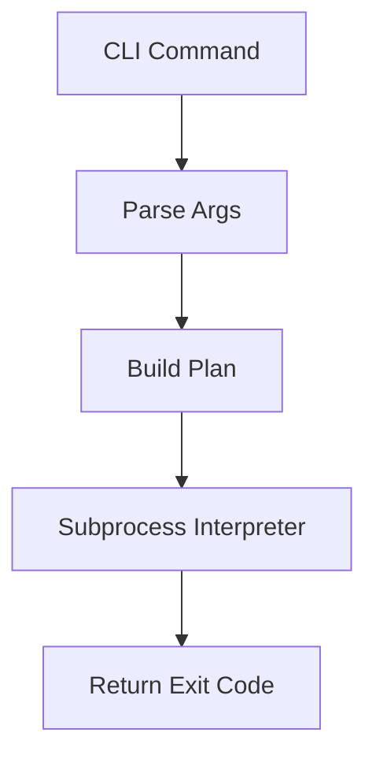

# Documentation Standards

**Status**: Authoritative source
**Supersedes**: N/A
**Referenced by**: ../README.md, ../AGENTS.md, ../CLAUDE.md, ../HASKELL_CLI_TOOL.md, ../DEVELOPMENT_PLAN/README.md, ../DEVELOPMENT_PLAN/development_plan_standards.md, ../DEVELOPMENT_PLAN/00-overview.md, engineering/README.md, engineering/cli_command_surface.md, engineering/code_quality.md, engineering/unit_testing_policy.md, engineering/haskell_code_guide.md, engineering/determinism_contract.md, engineering/transcript_format.md, engineering/backend_ffi_contract.md, engineering/compiler_runtime_tuning.md
**Generated sections**: none

> **Purpose**: Single Source of Truth (SSoT) for writing and maintaining documentation
> across the MCTS repository.

---

## 1. Philosophy

### SSoT-First

Every concept has exactly one canonical document. Other documents may reference but
never duplicate.

The CLI doctrine lives at [../HASKELL_CLI_TOOL.md](../HASKELL_CLI_TOOL.md). The
development plan lives at [../DEVELOPMENT_PLAN/README.md](../DEVELOPMENT_PLAN/README.md).
Project-specific engineering doctrine lives under [engineering/](./engineering/).
Operator-facing project intent lives at [../README.md](../README.md).

### Development Plan Authority

`../DEVELOPMENT_PLAN/README.md` is the single source of truth for phase order, sprint
status, blockers, remaining work, validation closure, and cleanup ownership.

Documents under this directory may explain architecture, doctrine, and verification
boundaries, but they must link back to the development plan instead of maintaining
competing status ledgers.

### DRY + Link Liberally

- Never copy-paste content between documents.
- Use relative links with section anchors.
- Prefer deep links: `./engineering/determinism_contract.md#per-game-seed-derivation`.

### Separation of Concerns

- **Engineering docs** (`engineering/`): architecture, design decisions, patterns,
  verification boundaries.
- **CLI docs** (generated under `cli/`): API documentation, command schema,
  generated tables, manpages, completion scripts.
- **Reference docs** (the doctrine, the development plan): authoritative rules.

---

## 2. Naming Conventions

### Primary Rule: snake_case

All documentation files under `documents/` use `snake_case.md`:

- `documentation_standards.md`
- `cli_command_surface.md`
- `determinism_contract.md`
- `transcript_format.md`

### Allowed Exceptions (ALL-CAPS)

- `README.md`
- `CLAUDE.md`
- `AGENTS.md`
- `LICENCE`
- `HASKELL_CLI_TOOL.md`

### Development Plan Suite

The repository-root `DEVELOPMENT_PLAN/` directory defines its own internal structure
and maintenance rules under
[../DEVELOPMENT_PLAN/development_plan_standards.md](../DEVELOPMENT_PLAN/development_plan_standards.md).
That plan suite uses `phase-N-kebab-case-title.md` and a few specific ALL-CAPS-style
filenames (`README.md`, `00-overview.md`) by deliberate exception; the rest of the
plan suite uses lowercase `snake_case` / `kebab-case` as well.

---

## 3. Required Header Metadata

Every document must include:

```markdown
# Document Title

**Status**: [Authoritative source | Reference only | Deprecated]
**Supersedes**: [N/A | path/to/old/doc.md]
**Referenced by**: [comma-separated list of consumers]
**Generated sections**: [comma-separated list of generated-section keys | none]

> **Purpose**: One-sentence description.
```

### Status Values

| Status | Meaning |
|--------|---------|
| `Authoritative source` | This is the SSoT for this topic |
| `Reference only` | Points to authoritative sources |
| `Deprecated` | Scheduled for removal |

### `**Generated sections**:` Metadata Field

Mandatory in every governed document. The value is either `none` or a comma-separated
list of the `<key>` portion of every marker pair the document contains (see
Section 11). The lint pass owned by `mcts docs check` enforces that the metadata and
the markers physically present in the file agree: declaring `none` when markers are
present is a lint failure, and declaring a key whose markers are missing is a lint
failure. The reference list of generated sections per file is the
`GeneratedSectionRule` registry described in
[../HASKELL_CLI_TOOL.md → Generated Artifacts](../HASKELL_CLI_TOOL.md).

---

## 4. Cross-Referencing Rules

### Relative Links with Anchors

```markdown
See [the per-game seed derivation](./engineering/determinism_contract.md#per-game-seed-derivation).
```

### Bidirectional Links

When document A references document B, document B's `Referenced by` should include A.

---

## 5. Duplication Rules

### Never Copy

- Configuration examples.
- Code snippets that exist in the source.
- The doctrine's own prescriptions — engineering docs cite the doctrine section by
  name; they do not paste its text.

### Always Link

```markdown
For sprint status and cleanup ownership, see
[Development Plan](../DEVELOPMENT_PLAN/README.md).
For CLI patterns, see [Haskell CLI doctrine](../HASKELL_CLI_TOOL.md).
```

---

## 6. Code Examples (Markdown)

### Always Specify Language

```haskell
-- File: src/MCTS/Engine/Board.hs
data Board = Board
    { boardHero       :: {-# UNPACK #-} !Word64
    , boardSideToMove :: {-# UNPACK #-} !Side
    , boardPly        :: {-# UNPACK #-} !Word16
    }
```

### File Path Comment

First line of code blocks should indicate source:

```haskell
-- File: src/MCTS/Search/Search.hs  -- Actual source file
```

Or for teaching examples:

```haskell
-- Example: Hypothetical pure search API
search :: GameState -> Seed -> SearchBudget -> Tree -> (Move, Tree)
```

### Current-Surface Examples Only

Code examples must not use:

- removed paths from retired backends (after retirement, examples must use the
  surviving cohort).
- unsupported toolchains or bridge layers.
- stale commands that bypass the public `mcts` surface.

---

## 7. Function Documentation

```haskell
-- | Mix a master seed with a game index to produce a per-game seed.
--
-- The mix is splitmix64, chosen because it is reproducible across backends
-- and bijective in `gameIndex` for any fixed `masterSeed`.
mix :: Word64 -> Word32 -> Word64
```

---

## 8. Mermaid Diagram Standards

### Allowed Types

- `flowchart TB` (top-bottom)
- `flowchart LR` (left-right)
- `graph TB` / `graph LR`
- `stateDiagram-v2`

### Forbidden

- Dotted lines (`-.->`)
- Subgraphs
- Complex nesting

### Example



---

## 9. Anti-Patterns

### Vague Status Values

- BAD: `**Status**: WIP`
- GOOD: `**Status**: Authoritative source`

### Copy-Pasted Content

- BAD: Duplicating the doctrine's `Subprocess` ADT definition.
- GOOD: Linking to
  [../HASKELL_CLI_TOOL.md → Architecture → Subprocesses as Typed
  Values](../HASKELL_CLI_TOOL.md).

### Examples Pointing at Removed Paths

- BAD: After backend (i) retires, `See the cpp-legacy bench dispatch`.
- GOOD: `See ../DEVELOPMENT_PLAN/legacy-tracking-for-deletion.md for retirement
  history`.

---

## 10. Intent Ownership

This SSoT co-owns documentation-topology doctrine intention.

- Owned statement: SSoT ownership, bidirectional links, and non-duplication rules are
  mandatory for all new doctrinal content.
- Linked dependents: `engineering/README.md`,
  `../DEVELOPMENT_PLAN/development_plan_standards.md`.

---

## 11. Generated Sections

This section documents the generated-sections discipline mandated by
[../HASKELL_CLI_TOOL.md → Generated Artifacts](../HASKELL_CLI_TOOL.md) and
[../HASKELL_CLI_TOOL.md → Project-level documentation
standards](../HASKELL_CLI_TOOL.md). The doctrine is the authoritative source for the
underlying registry shape, marker conventions, paired check/write commands, and drift
enforcement; this section restates the contract for documentation contributors who do
not need to read the full doctrine.

### Marker Conventions

Generated sections are delimited by paired sentinel comments in the host syntax of the
target file. The marker key is dotted, hierarchical, and unique across the
`GeneratedSectionRule` registry.

| File type | Start marker | End marker |
|-----------|--------------|------------|
| Markdown | `<!-- mcts:<key>:start -->` | `<!-- mcts:<key>:end -->` |
| YAML | `# mcts:<key>:start` | `# mcts:<key>:end` |
| Haskell | `-- mcts:<key>:start` | `-- mcts:<key>:end` |
| C / C++ / Rust | `// mcts:<key>:start` | `// mcts:<key>:end` |

Example: a generated command-registry table inside this file might look like:

```markdown
<!-- mcts:<key>:start -->
| Command | Summary |
|---------|---------|
| `mcts bench rollouts` | Random-rollouts benchmark across the live backend cohort |
<!-- mcts:<key>:end -->
```

### Authoritative List of Files with Generated Regions

The single source of truth is the in-code `GeneratedSectionRule` registry consumed by
`mcts docs check` and `mcts docs generate`. Every file that contains markers must
declare its keys in its `**Generated sections**:` metadata field (Section 3); the
lint pass enforces agreement.

Generation targets enumerated by
[../HASKELL_CLI_TOOL.md → Generated Artifacts](../HASKELL_CLI_TOOL.md) include CLI
help, command reference docs, JSON command schemas, and cross-language types. The
currently scheduled registry entries are:

| Generation target | Marker key prefix | Owning sprint |
|-------------------|-------------------|---------------|
| CLI command reference | `command-registry`, `cli-help.*` | Sprint 1.2 / Sprint 1.3 |
| Generated section index in this file | `documentation-standards.*` | Sprint 1.3 |
| Cross-language types (TypeScript / Go mirrors) | `cross-language-types.*` | **Deferred** — no non-Haskell consumer is in scope today |

### How to Regenerate

Run `mcts docs generate` to splice the current renderer output between every marker
pair declared in the registry. Hand edits between markers are reverted on the next
regenerate and fail `mcts docs check` until reverted.

The check command emits the doctrine's three-element error message on drift:

1. The file path that drifted.
2. The marker key (so the contributor knows which renderer is responsible).
3. A literal remedy hint: `` Run `mcts docs generate` to update. ``

### How to Add a New Generated Section

The doctrine's five-step extension protocol:

1. Define or extend the renderer in the relevant Haskell library module under
   `src/MCTS/Generated/`.
2. Add the marker pair to the target file using the conventions above.
3. Register a new `GeneratedSectionRule` or `TrackedGeneratedPath` entry in the
   in-code registry.
4. Run `mcts docs generate` to populate the section.
5. Confirm `mcts docs check` and `cabal test` pass.

### Fully Generated, Do-Not-Hand-Edit Paths

A separate tracked-generated-paths registry names files that are owned wholly by code
generators (no markers required because the entire file is generated). The
`trackingGeneratedPaths` registry in `src/MCTS/Generated/Paths.hs` is the
authoritative source, with `mcts lint files` refusing drift on paths such as:

- `documents/cli/commands.md`
- `share/man/man1/mcts.1`
- `share/man/man1/mcts-*.1`
- `share/completion/bash/mcts`
- `share/completion/zsh/_mcts`
- `share/completion/fish/mcts.fish`

The current registry contents are the authoritative source; future fully-generated
paths must be added there in the same change that introduces them. The
`mcts-haskell-style` suite also checks the renderer-source modules named by the
registry for forbidden non-deterministic inputs such as timestamps, random IDs,
locale-dependent ordering, terminal-width state, and environment-derived paths.

---

## Cross-References

- [Engineering docs index](./engineering/README.md)
- [Development Plan](../DEVELOPMENT_PLAN/README.md)
- [HASKELL_CLI_TOOL.md](../HASKELL_CLI_TOOL.md) — canonical CLI doctrine
- [CLAUDE.md](../CLAUDE.md) — AI assistant guidelines
- [AGENTS.md](../AGENTS.md) — agent guidelines
- [README.md](../README.md) — project intent and command surface
